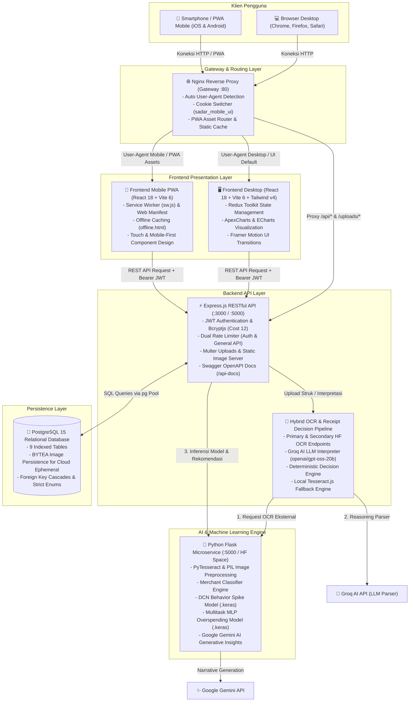

# SADAR Finance (Smart AI-Driven Automated Receipt & Finance Management)

<p align="center">
  
</p>

<p align="center">
  <strong>Solusi Manajemen Keuangan Pribadi Cerdas Berbasis Kecerdasan Buatan (AI-Driven) untuk Membangun Pola Finansial yang Sadar, Terukur, dan Bertanggung Jawab.</strong>
</p>

<p align="center">
  
  
  
  
  
  
  
  
</p>

---

## 📖 Tentang SADAR Finance

**SADAR Finance** adalah platform manajemen keuangan pribadi (*personal finance*) cerdas generasi baru yang dirancang khusus untuk memandu individu mengelola uang secara bijak dan berkesadaran penuh (*mindful spending*).

Aplikasi ini menggabungkan pencatatan otomatis tanpa repot (*effortless logging*), analitik perilaku berbasis pembelajaran mendalam (*deep learning*), serta sistem peringatan dini prediktif (*predictive early-warning*).

### 🌟 Pilar Keunggulan SADAR Finance:
1. **Otomatisasi OCR & NLP Multi-Tier**: Pengguna cukup mengunggah foto struk belanja; sistem akan mengekstrak nama *merchant*, tanggal, daftar barang, subtotal, dan total belanja secara akurat dengan integrasi *Hugging Face OCR*, *Groq AI Reasoning LLM*, serta *Local Tesseract Fallback*.
2. **AI Merchant & Category Classifier**: Mengelompokkan transaksi secara otomatis ke dalam kategori standar (*Food & Dining*, *Transportation*, *Shopping*, dll.) dan kelompok anggaran (*Needs*, *Wants*, *Savings*, *Other*).
3. **Behavior Spike Modeling (DCN)**: Memodelkan pola belanja menggunakan arsitektur **Deep & Cross Network (DCN)** untuk mendeteksi transaksi anomali atau lonjakan belanja konsumtif, dipadukan dengan saran taktis berbasis **Google Gemini Generative AI**.
4. **End-of-Month Overspending Forecast (Multitask MLP)**: Memproyeksikan potensi pembengkakan anggaran sebelum penutupan bulan menggunakan jaringan saraf tiruan **Multi-task Multi-Layer Perceptron (MLP)**.
5. **Skor Kesehatan Keuangan (0–100) & Formula 50/30/20**: Menghitung indeks kesehatan finansial komprehensif berdasarkan rasio tabungan, kepatuhan alokasi ideal (50% Kebutuhan, 30% Keinginan, 20% Tabungan/Investasi), dan stabilitas arus kas.
6. **Dukungan Multi-Device & Mobile PWA**: Menghadirkan pengalaman desktop web yang lengkap sekaligus aplikasi *Progressive Web App (PWA)* mobile yang responsif, dapat diinstal (*Add to Home Screen*), dan mendukung mode *offline*.

---

## 🏛️ Arsitektur Sistem & Ekosistem Multi-Service

SADAR Finance dibangun menggunakan arsitektur **Decoupled Multi-Service** yang modular, tangguh, dan siap untuk lingkungan produksi:



---

## 💎 Fitur Utama & Struktur Menu Aplikasi

Antarmuka SADAR Finance dirancang dengan visual modern, elegan, dan ramah pengguna yang terbagi dalam menu-menu utama:

### 1. Landing Page (`/`, `/landing`)
*   **Hero Showcase**: Pengenalan nilai produk dengan animasi interaktif modern dan responsif berbasis Tailwind CSS v4.
*   **Feature Breakdown**: Sorotan fitur unggulan (Pencatatan AI, Scanner Struk, Skor Finansial, Analisis 50/30/20).
*   **Quick Action**: Navigasi langsung menuju halaman Pendaftaran (*Register*) atau Masuk (*Login*).

### 2. Dashboard Keuangan (`/dashboard`)
*   **Greeting Personal**: Sapaan dinamis berdasarkan data profil pengguna.
*   **5 Metrik Finansial Utama**: Menampilkan Saldo Gabungan, Pemasukan Bulan Ini, Pengeluaran Bulan Ini, Sisa Anggaran, dan Total Catatan Keuangan.
*   **Cashflow Chart**: Visualisasi interaktif perbandingan arus kas pemasukan vs pengeluaran bulanan.
*   **Expense Trend**: Grafik tren laju pengeluaran harian/mingguan untuk memantau waktu konsumsi puncak.
*   **Spending Category (Donut Chart)**: Pembagian porsi pengeluaran berdasarkan kategori utama.
*   **Smart Insight & Predictive Spending Alert**: Rekomendasi AI dan peringatan dini apabila terdeteksi anomali atau potensi *overspending*.
*   **Recent Transactions**: Tabel 5–10 transaksi belanja terbaru dengan status kategori.

### 3. Catat Keuangan (`/catat-keuangan` / `/transactions/input`)
*   **Tab Transaksi (Pengeluaran)**:
    *   *Input Manual*: Pengisian nominal, tanggal, kategori belanja, kategori detail, akun dompet/bank, dan catatan deskripsi.
    *   *Upload Struk (OCR & AI Parsing)*: Unggah foto struk/nota. Sistem mengekstrak nama toko/merchant, tanggal, rincian barang, dan total belanja secara otomatis, menyediakan pratinjau hasil ekstraksi, dan melakukan *autofill* formulir yang dapat disunting sebelum disimpan.
*   **Tab Income (Pemasukan)**:
    *   Pencatatan pemasukan dana (Gaji, Freelance, Investasi, Bonus) yang langsung dialokasikan ke akun keuangan tujuan untuk menambah saldo secara otomatis.

### 4. Behavior Insight (`/behavior-insight`)
*   **Weekend vs Weekday Behavior**: Komparasi mendalam intensitas transaksi dan nominal belanja antara hari kerja vs akhir pekan.
*   **Kategori Dominan**: Analisis sektor belanja yang paling banyak menyerap anggaran.
*   **Rekomendasi Kebiasaan AI**: Masukan taktis berbasis kebiasaan historis untuk menekan pengeluaran konsumtif yang tidak esensial.

### 5. Skor Kesehatan Keuangan (`/financial-score`)
*   **Skor Finansial (0–100)**:
    *   `71 - 100`: **Sehat** (Hijau)
    *   `41 - 70`: **Cukup Sehat** (Jingga)
    *   `0 - 40`: **Perlu Perhatian** (Merah)
*   **Evaluasi Formula 50/30/20**: Membandingkan realisasi belanja terhadap standar keuangan ideal:
    *   **50% Kebutuhan (Needs)**: Makan pokok, transportasi, tagihan/utilitas, kesehatan, pendidikan.
    *   **30% Keinginan (Wants)**: Hiburan, belanja sekunder, rekreasi, gaya hidup.
    *   **20% Tabungan & Investasi (Savings)**: Dana darurat, tabungan, investasi reksadana/saham.
*   **Faktor Pembentuk Skor**: Evaluasi rasio tabungan, kepatuhan budget, konsistensi pencatatan, dan deviasi pengeluaran.

### 6. Riwayat Keuangan Lengkap (`/financial-history`)
*   Halaman rekapitulasi data keuangan terdedikasi yang memuat seluruh riwayat transaksi pengeluaran dan pemasukan.
*   Mendukung pencarian teks cepat, filter rentang tanggal, filter jenis transaksi, pengurutan kolom, dan paginasi interaktif.

### 7. Profil & Akun Pengguna (`/profile-account` & `/profile-account/edit`)
*   **Manajemen Profil**: Pembaruan nama, email, nomor ponsel, pekerjaan, alamat, dan foto profil.
*   **Kelola Akun Keuangan**: CRUD rekening bank, e-wallet, atau kas fisik beserta nomor akun dan saldo awal.
*   **Atur Target Budget Bulanan**: Menetapkan pagu anggaran spesifik untuk pos *Needs*, *Wants*, dan *Savings/Investment*.

### 8. Fitur Mobile Progressive Web App (PWA)
*   **Instalasi Mandiri (*Add to Home Screen*)**: Dapat diinstal layaknya aplikasi native pada perangkat Android dan iOS.
*   **Dukungan Offline**: Layanan service worker (`sw.js`) dan halaman cadangan (`offline.html`) saat koneksi terputus.
*   **Navigasi Mobile-First**: Bottom navigation bar, bottom sheets, dan tata letak responsif yang nyaman digunakan dengan satu tangan.

### 9. Halaman Kebijakan & Legalitas
*   `Privacy Policy` (`/privacy-policy` / `/privancy-policy`)
*   `Terms & Conditions` (`/terms-conditions` / `/term-conditions`)

---

## 🧠 Modul AI & Machine Learning Deep Dive

Kecerdasan buatan di SADAR Finance digerakkan oleh kombinasi model analitik terstruktur dan pemodelan bahasa:

### 1. Hybrid OCR & Receipt Decision Pipeline
*   **Prapemrosesan Gambar**: Penyesuaian kontras dinamis, penajaman (*sharpening*), konversi skala abu-abu (*grayscale*), dan normalisasi resolusi (lebar target `600px`, batas tinggi `1800px`).
*   **Multi-Provider Recognition**:
    *   *Primary & Secondary HF OCR Endpoints*: Mengirim berkas gambar ke microservice AI untuk ekstraksi baris teks berbasis Tesseract Engine (`ind+eng`, `--psm 6`).
    *   *Local Tesseract.js Fallback*: Backend mengeksekusi OCR internal jika seluruh endpoint eksternal gagal.
*   **Groq AI LLM Reasoning Parser**: Menggunakan model `openai/gpt-oss-20b` via Groq Cloud API untuk mengubah teks mentah menjadi entitas terstruktur (nama merchant, tanggal transaksi berformat ISO, rincian item, dan total nominal belanja).
*   **Deterministic Validation Engine**: Memastikan kepatuhan tipe data, memeriksa konsistensi jumlah subtotal item terhadap total belanja, serta memberikan skor keyakinan (*confidence score*).

### 2. Merchant & Category Classifier
*   Mengklasifikasikan nama toko/merchant dan deskripsi belanja ke dalam kategori pengeluaran standar.
*   Menerapkan model klasifikasi machine learning berbasis representasi teks tersemat (*text embeddings*) dengan *rule-based fallback pattern* untuk menjamin kecepatan dan keandalan respons API.

### 3. Behavior Spike Prediction (DCN)
*   **Arsitektur Deep & Cross Network (DCN)**: Menggabungkan lapisan *Cross Network* (untuk menangkap interaksi fitur non-linear berulang secara eksplisit) dan lapisan *Deep Feed-Forward Neural Network* (untuk generalisasi representasi fitur mendalam).
*   **Fitur Input**: Nominal transaksi, hari dalam minggu, status akhir pekan (*is_weekend*), jam transaksi, merchant, metode pembayaran, dan *rolling 7-day spending*.
*   **Generative Narrative (Google Gemini API)**: Mengonversi hasil skor prediksi anomali menjadi kalimat saran finansial persuasif dalam Bahasa Indonesia menggunakan model Gemini (`gemini-3.1-flash-lite` / `gemini-1.5-flash`).

### 4. Overspending Forecast (Multitask MLP)
*   **Multitask MLP dengan Residual Dense Blocks**: Menerima vektor fitur numerik berdimensi `61` untuk mengevaluasi status pengeluaran berjalan pengguna.
*   **Dual-Head Output**: Menghasilkan estimasi probabilitas terjadinya pembengkakan anggaran sebelum akhir bulan (*classification output*) sekaligus prediksi nominal kelebihan belanja (*regression output*).
*   **Sigmoid Logistic Fallback**: Jika data historis pengguna belum mencukupi untuk inferensi model neural, sistem mengaktifkan model moving-average harian dengan fungsi pemetaan logistik sigmoid:
    $$\text{Probability} = \frac{1}{1 + e^{-5.0 \times (\text{ratio} - 1.0)}}$$

---

## 🗄️ Skema Database PostgreSQL

Database SADAR Finance menggunakan PostgreSQL 15 dengan 9 tabel terelasi yang telah dioptimasi dengan indeks performa, aturan *cascading delete*, dan tipe data biner untuk persistensi aset di cloud:

```
                                 +------------------+
                                 |      users       |
                                 +------------------+
                                 | PK | users_id    |
                                 +----+--------------+
                                        |  |  |
            +---------------------------+  |  +-----------------------------+
            |                              |                                |
            v                              v                                v
+------------------+             +------------------+             +------------------+
|     accounts     |             |     insights     |             |      alerts      |
+------------------+             +------------------+             +------------------+
| PK | account_id  |             | PK | insight_id  |             | PK | alert_id    |
| FK | user_id     |             | FK | user_id     |             | FK | user_id     |
+------------------+             +------------------+             +------------------+
    |         |
    |         +-----------------+
    v                           v
+------------------+    +------------------+             +------------------+
|   transactions   |    |     incomes      |             |      scores      |
+------------------+    +------------------+             +------------------+
| PK | transaction_id|  | PK | income_id   |             | PK | score_id    |
| FK | user_id     |    | FK | user_id     |             | FK | user_id     |
| FK | account_id  |    | FK | account_id  |             +------------------+
+------------------+    +------------------+
    ^                         ^
    |                         |
    |  +----------------------+
    |  |
+------------------+
|     budgets      |
+------------------+
| PK | budget_id   |
| FK | user_id     |
| FK | income_id   |
+------------------+
    ^
    | (opsional)
+------------------+
|    ocr_scans     |
+------------------+
| PK | ocr_id      |
| FK | user_id     |
| FK | transaction_id|
+------------------+
```

### Kamus Data & Spesifikasi Kolom:

1. **`users`**: Informasi akun pengguna, kredensial sandi (bcrypt cost 12), dan status keanggotaan.
   * `users_id` (UUID PK), `first_name`, `last_name`, `email` (Unique), `password_hash`, `phone_number`, `gender`, `date_of_birth`, `address`, `occupation`, `profile_picture`, `status` (`user_status`: `'active'`, `'inactive'`, `'suspended'`), `created_at`, `updated_at`.
2. **`accounts`**: Rekening bank, e-wallet, atau dompet tunai milik pengguna.
   * `account_id` (UUID PK), `user_id` (UUID FK), `account_name`, `account_number`, `balance` (DECIMAL 15,2), `created_at`, `updated_at`.
3. **`transactions`**: Riwayat pengeluaran dana harian.
   * `transaction_id` (UUID PK), `user_id` (UUID FK), `account_id` (UUID FK), `category_group` (`Needs`, `Wants`, `Savings`, `Other`), `category_detail` (Kategori spesifik), `transaction_date` (TIMESTAMPTZ), `description`, `source` (`manual`, `ocr`), `amount` (DECIMAL 15,2 > 0), `created_at`.
4. **`incomes`**: Riwayat pemasukan uang.
   * `income_id` (UUID PK), `user_id` (UUID FK), `account_id` (UUID FK), `amount` (DECIMAL 15,2 > 0), `income_date` (TIMESTAMPTZ), `source`, `created_at`.
5. **`budgets`**: Penetapan pagu anggaran bulanan dan alokasi formula 50/30/20.
   * `budget_id` (UUID PK), `user_id` (UUID FK), `income_id` (UUID FK), `needs_budget` / `needs_amount`, `wants_budget` / `wants_amount`, `investment_budget` / `investment_amount` / `savings_amount`, `income_amount`, `budget_limit` / `limit_amount`, `percentage`, `source`, `income_date`, `created_at`.
6. **`insights`**: Rekomendasi dan evaluasi analitik perilaku belanja yang dihasilkan AI.
   * `insight_id` (UUID PK), `user_id` (UUID FK), `title`, `description`, `created_at`.
7. **`alerts`**: Log notifikasi risiko keuangan dan peringatan *overspending*.
   * `alert_id` (UUID PK), `user_id` (UUID FK), `message`, `alert_type` (`'overspending'`, `'budget_exceeded'`, `'anomaly'`, `'reminder'`, `'info'`), `created_at`.
8. **`scores`**: Histori kalkulasi skor kesehatan finansial (0–100).
   * `score_id` (UUID PK), `user_id` (UUID FK), `score` (INTEGER 0–100), `created_at`.
9. **`ocr_scans`**: Log audit pemrosesan gambar struk belanja.
   * `ocr_id` (UUID PK), `user_id` (UUID FK), `transaction_id` (UUID FK), `image_url`, `image_data` (BYTEA — persistensi biner gambar agar tidak hilang pada lingkungan hosting *ephemeral* seperti Railway), `original_name`, `mime_type`, `file_size`, `status` (`'pending'`, `'processing'`, `'completed'`, `'failed'`), `raw_text`, `parsed_data` (JSONB), `confidence`, `error_message`, `processed_at`, `created_at`.

---

## ⚙️ Skenario Integrasi Data & Autentikasi Frontend

Frontend SADAR Finance dilengkapi sakelar konfigurasi lingkungan yang fleksibel di berkas `.env` untuk mendukung mode demonstrasi cepat, peninjauan juri/penguji, maupun integrasi penuh:

| Skenario (`VITE_SADAR_DATA_SCENARIO`) | Autentikasi | Sumber Data Finansial | Deskripsi Penggunaan |
|---|---|---|---|
| `backend-only` *(Default Production)* | Backend JWT Auth | PostgreSQL via Express API | Mode produksi ketat; seluruh autentikasi dan data berasal murni dari database. |
| `backend-with-backend-auth` | Backend JWT Auth | PostgreSQL via Express API | Mode pengujian End-to-End penuh dengan akun pengguna aktif di database. |
| `mock-with-backend-auth` | Backend JWT Auth | Mock Local Datasets | Mode demo cepat: Login diverifikasi ke server backend, namun tampilan dashboard memuat data sampel visual yang kaya. |

*   **Kredensial Login Demo (Backend Auth)**:
    *   *Email*: `demo@sadarfinance.com`
    *   *Password*: `Demo@12345`
*   **Mode Pengembang Mandiri (Fake Auth)**:
    Jika `VITE_DEFAULTAUTH=fake` diaktifkan, login disimulasikan di klien menggunakan `aqyla@example.com` / `123456`.

---

## 🛠️ Spesifikasi Tech Stack

| Lapisan / Komponen | Teknologi & Pustaka | Peran & Deskripsi |
| :--- | :--- | :--- |
| **Gateway Layer** | Nginx Alpine, Docker | Smart reverse proxy, deteksi perangkat User-Agent, cookie routing, dan proxy API. |
| **Frontend Desktop** | React 18, Vite 6, Redux Toolkit, React Router v7 | Single Page Application (SPA) desktop interaktif. |
| **Frontend Mobile** | React 18, Vite 6, Service Worker, Web Manifest | Mobile Progressive Web App (PWA) dengan touch-first UI dan dukungan offline. |
| **UI Styling & Animasi** | Tailwind CSS v4, Bootstrap 5, Sass, Framer Motion, GSAP | Desain visual modern, transisi halus, dan tata letak responsif. |
| **Visualisasi Data** | ApexCharts, ECharts, Chart.js, react-apexcharts | Grafik batang arus kas, grafik donat kategori, dan diagram garis tren belanja. |
| **Backend REST API** | Node.js (>=18), Express.js 4, Multer, Joi | Server API modular, validasi request ketat, dan penangan unggah berkas. |
| **Database Engine** | PostgreSQL 15+, pg (`node-postgres`) | Database relasional ACID dengan indeks teroptimasi dan kolom biner BYTEA. |
| **Keamanan Server** | JWT, bcryptjs, Helmet, Express Rate Limit, CORS | Proteksi endpoint, pembatasan laju permintaan, enkripsi sandi, dan keamanan HTTP. |
| **Dokumentasi API** | Swagger UI Express, Swagger JSDoc (OpenAPI 3.0) | Dokumentasi interaktif REST API di `/api-docs`. |
| **Hybrid OCR Engine** | Hugging Face OCR, tesseract.js, PyTesseract | Ekstraksi teks multi-tier dari gambar struk belanja. |
| **AI LLM Reasoning** | Groq Cloud API (`openai/gpt-oss-20b`) | Parsing teks struk OCR menjadi data transaksi terstruktur berkecepatan tinggi. |
| **Generative AI** | Google Generative AI (Gemini SDK) | Pembuatan teks rekomendasi finansial kontekstual dalam Bahasa Indonesia. |
| **Machine Learning** | TensorFlow 2.18, Keras, NumPy, Pandas, Scikit-learn | Inferensi model Deep & Cross Network (DCN) dan Multitask MLP Overspending. |
| **AI Microservice** | Python 3.8+, Flask, Flask-CORS, Pillow | Server inferensi AI prediktif dan prapemrosesan citra struk. |

---

## 📂 Struktur Direktori Repositori

```
sadar-finance/
├── ai/                                 # Python AI Microservice (Flask & TensorFlow)
│   ├── dataset/                        # Dataset pelatihan model
│   ├── docs/                           # Dokumentasi spesifik modul AI
│   ├── inference/                      # Skrip inferensi model runtime (OCR, Behavior, Overspending, Categorizer)
│   ├── models/                         # Bobot model biner (.keras) & Metadata JSON
│   ├── preprocessing/                  # Modul pemrosesan teks NLP struk belanja
│   ├── tmp_uploads/                    # Direktori penyimpanan sementara citra struk
│   ├── app.py                          # Entrypoint Flask Server AI
│   ├── behavior_model.py               # Definisi custom layer & arsitektur model DCN
│   ├── Dockerfile                      # Spesifikasi build container AI
│   └── requirements.txt                # Daftar pustaka dependensi Python
│
├── backend/                            # Node.js Express RESTful API Server
│   ├── config/                         # Konfigurasi Database, CORS, Rate Limit, JWT, & Swagger
│   ├── controllers/                    # Penangan alur request/response API (Auth, Transaksi, OCR, dll.)
│   ├── db/                             # Skrip migrasi skema tabel (migrate.js) & data seed (seed.js)
│   ├── middlewares/                    # Middleware autentikasi JWT, validasi Joi, & error handler
│   ├── repositories/                   # Layer akses kueri langsung SQL PostgreSQL
│   ├── routes/                         # Deklarasi rute endpoint RESTful API v1
│   ├── services/                       # Logika bisnis inti (OCR pipeline, Groq AI, Analytics, Transaksi)
│   ├── utils/                          # Helper respon JSON terstandarisasi & penangan error DB
│   ├── validators/                     # Skema validasi skema input Joi
│   ├── uploads/                        # Direktori penyimpanan fisik berkas struk
│   ├── Dockerfile                      # Spesifikasi build container backend
│   ├── package.json                    # Dependensi & skrip backend Node.js
│   └── server.js                       # Entrypoint utama server Express
│
├── frontend/                           # React 18 SPA Desktop Web Client
│   ├── public/                         # Aset statis publik, logo, dan favicon
│   ├── src/
│   │   ├── Components/                 # Komponen UI modular & client API axios
│   │   ├── Layouts/                    # Layout global (Sidebar, Header, Footer)
│   │   ├── pages/                      # Halaman aplikasi (Dashboard, Catat, Score, History, dll.)
│   │   ├── Routes/                     # Konfigurasi perutean React Router v7
│   │   ├── slices/                     # Redux slices untuk auth dan tata letak
│   │   ├── tailwind.css                # Konfigurasi Tailwind CSS v4
│   │   └── main.jsx                    # Root render React klien
│   ├── Dockerfile                      # Spesifikasi build container frontend desktop
│   ├── package.json                    # Dependensi frontend desktop
│   └── vite.config.js                  # Konfigurasi bundler Vite
│
├── frontend-mobile/                    # React 18 Mobile Progressive Web App (PWA)
│   ├── public/                         # Manifest PWA (manifest.webmanifest), Service Worker (sw.js), & Icon
│   ├── src/                            # Komponen & halaman aplikasi yang dioptimasi untuk mobile
│   ├── Dockerfile                      # Spesifikasi build container frontend mobile
│   ├── package.json                    # Dependensi frontend mobile
│   └── vite.config.js                  # Konfigurasi bundler Vite mobile
│
├── gateway/                            # Nginx Smart Reverse Proxy & Gateway Layer
│   ├── Dockerfile                      # Spesifikasi build Nginx gateway
│   ├── mobile-ui-choice.js             # Skrip injeksi pemilih UI mobile/desktop
│   └── nginx.conf                      # Konfigurasi routing User-Agent & Reverse Proxy
│
├── docs/                               # Panduan integrasi, AI deployment, dan handoff teknis
├── documentation/                      # Dokumentasi komprehensif (PRD, Arsitektur, DB, API, Desain)
├── scripts/                            # Skrip utilitas pengujian dan kompresi
├── docker-compose.yml                  # Orkestrasi multi-container produksi lokal
├── sadar-finance.md                    # Ringkasan rancangan awal sistem
└── vercel.json                         # Konfigurasi routing deploy Vercel
```

---

## ⚡ Panduan Konfigurasi Variabel Lingkungan (.env)

Salin berkas template `.env.example` menjadi `.env` pada masing-masing subfolder service:

### 1. Backend (`backend/.env`)
```env
NODE_ENV=development
PORT=3000
CORS_ORIGINS=http://localhost:5173,http://localhost:5174,https://*.vercel.app

# Konfigurasi PostgreSQL
DB_HOST=localhost
DB_PORT=5432
DB_NAME=sadar_finance
DB_USER=postgres
DB_PASSWORD=your_local_postgres_password
DB_SSL=false

# Autentikasi JWT
JWT_SECRET=your_super_secret_jwt_key_change_in_production
JWT_EXPIRES_IN=7d

# Microservice AI (Hugging Face / Lokal)
AI_SERVICE_URL=https://sadar-finance-sadar-finance-ai.hf.space
AI_API_KEY=
AI_SERVICE_TIMEOUT_MS=15000
AI_MOCK_MODE=false

# Multi-Endpoint OCR
HF_OCR_PRIMARY_URL=https://sadar-finance-sadar-finance-ai.hf.space
HF_OCR_PRIMARY_TOKEN=
HF_OCR_SECONDARY_URL=
HF_OCR_SECONDARY_TOKEN=
HF_OCR_TIMEOUT_MS=20000
HF_OCR_MIN_QUALITY=0.65
OCR_LOCAL_FALLBACK=true

# Groq AI Receipt Interpretation (Server-side LLM)
GROQ_API_KEY=your_groq_cloud_api_key_here
GROQ_MODEL=openai/gpt-oss-20b
GROQ_TIMEOUT_MS=15000
GROQ_REASONING_EFFORT=low

# Rate Limiter & Unggah Berkas
RATE_LIMIT_WINDOW_MS=900000
RATE_LIMIT_MAX=600
AUTH_RATE_LIMIT_WINDOW_MS=900000
AUTH_RATE_LIMIT_MAX=50
MAX_FILE_SIZE_MB=10
UPLOAD_DIR=uploads
```

### 2. AI Microservice (`ai/.env`)
```env
PORT=5000
TESSERACT_CMD=C:\Program Files\Tesseract-OCR\tesseract.exe  # Path binary Tesseract di Windows
GENERATIVE_AI_MODEL=gemini-3.1-flash-lite
GEMINI_API_KEY=your_google_gemini_api_key_here             # Opsional: Untuk saran teks AI
```

### 3. Frontend Desktop (`frontend/.env`)
```env
VITE_DEFAULTAUTH=sadar
VITE_API_URL=http://localhost:3000/api/v1
VITE_AI_URL=http://localhost:5000
VITE_SADAR_DATA_SCENARIO=backend-only
```

### 4. Frontend Mobile PWA (`frontend-mobile/.env`)
```env
VITE_DEFAULTAUTH=sadar
VITE_API_URL=http://localhost:3000/api/v1
VITE_AI_URL=http://localhost:5000
VITE_SADAR_DATA_SCENARIO=backend-only
```

---

## 🚀 Panduan Memulai & Menjalankan Aplikasi

Anda dapat menjalankan ekosistem SADAR Finance menggunakan **Docker Compose (Direkomendasikan)** atau **Secara Manual**.

### Opsi A: Menjalankan via Docker Compose (Semua Layanan Otomatis)

Pastikan [Docker Desktop](https://www.docker.com/products/docker-desktop/) telah terpasang dan berjalan:

```bash
# 1. Masuk ke direktori root proyek
cd sadar-finance

# 2. Bangun dan jalankan seluruh container secara simultan
docker compose up --build
```

Setelah seluruh container siap:
*   **Aplikasi Web (Gateway)**: `http://localhost` (Otomatis mendeteksi perangkat desktop atau smartphone).
*   **RESTful API Backend**: `http://localhost:5000/api/v1`
*   **Swagger API Docs**: `http://localhost:5000/api-docs`
*   **Health Check**: `http://localhost/health`

---

### Opsi B: Menjalankan Secara Manual (Multi-Terminal)

#### Prasyarat Lingkungan Lokal:
*   **Node.js** (Versi LTS >= 18) & npm.
*   **PostgreSQL** (Versi >= 15) aktif di sistem lokal.
*   **Python** (Versi >= 3.8) beserta virtual environment (`venv`).
*   **Tesseract OCR Engine** terpasang di OS Anda:
    *   *Windows*: Pasang via `winget install --id UB-Mannheim.TesseractOCR -e` (Lokasi default: `C:\Program Files\Tesseract-OCR\tesseract.exe`).
    *   *macOS*: `brew install tesseract tesseract-lang`
    *   *Linux (Ubuntu/Debian)*: `sudo apt update && sudo apt install tesseract-ocr tesseract-ocr-ind`

#### Langkah Eksekusi Terminal:

##### 🟢 Terminal 1: Backend REST API & PostgreSQL
```bash
cd backend
npm install

# Buat database 'sadar_finance' via psql / pgAdmin terlebih dahulu jika belum ada
npm run db:migrate   # Membuat struktur 9 tabel
npm run db:seed      # Mengisi data awal uji coba
npm run dev          # Menjalankan server Express di http://localhost:3000
```

##### 🟢 Terminal 2: AI Microservice (Python Flask)
```bash
cd ai
python -m venv venv

# Aktivasi Virtual Environment
# Windows: venv\Scripts\activate
# Linux/macOS: source venv/bin/activate

pip install -r requirements.txt
python app.py        # Menjalankan Flask di http://localhost:5000
```

##### 🟢 Terminal 3: Frontend Desktop (React Web)
```bash
cd frontend
npm install
npm run dev          # Menjalankan Vite Desktop di http://localhost:5173
```

##### 🟢 Terminal 4: Frontend Mobile PWA (Opsional untuk pengujian mobile)
```bash
cd frontend-mobile
npm install
npm run dev          # Menjalankan Vite Mobile PWA di http://localhost:5174
```

Buka peramban browser Anda ke `http://localhost:5173` untuk mulai menjelajahi SADAR Finance.

---

## ☁️ Panduan Deployment Cloud

Aplikasi ini telah dirancang untuk siap di-deploy secara mudah ke infrastruktur cloud modern:

1. **Frontend Desktop & Mobile (Vercel)**:
   * Hubungkan repositori GitHub ke Vercel.
   * Tetapkan Root Directory ke `frontend` (untuk versi desktop) atau `frontend-mobile` (untuk PWA).
   * File `vercel.json` telah menyertakan aturan *URL rewrite* otomatis untuk merutekan panggilan `/api/v1/*` dan `/uploads/*` ke backend Railway.
2. **Backend & Database PostgreSQL (Railway)**:
   * Buat project baru di Railway, tambahkan layanan **PostgreSQL Database**.
   * Tambahkan layanan web yang mengarah ke direktori `backend/`. Konfigurasikan variabel environment (`DATABASE_URL`, `JWT_SECRET`, `AI_SERVICE_URL`, `GROQ_API_KEY`, dll.).
   * Jalankan migrasi dan seeding via Railway CLI atau interface terminal Railway: `npm run db:migrate && npm run db:seed`.
3. **AI Microservice (Hugging Face Spaces)**:
   * Buat Space baru dengan tipe **Docker Space**.
   * Unggah seluruh isi direktori `ai/` beserta berkas `Dockerfile`, bobot model `.keras`, dan `requirements.txt`.

---

## 🔎 Penanganan Kendala (Troubleshooting & FAQ)

*   **Error: "pytesseract.TesseractNotFoundError" pada Microservice AI**:
    *   *Solusi*: Pastikan Tesseract OCR telah terpasang. Verifikasi berkas `ai/.env` agar variabel `TESSERACT_CMD` menunjuk tepat ke file executable `tesseract.exe`.
*   **Koneksi Database PostgreSQL Gagal**:
    *   *Solusi*: Jalankan skrip diagnostik mandiri untuk memeriksa koneksi:
        ```bash
        npm run db:check
        ```
        Pastikan username, password, port (default `5432`), dan status service PostgreSQL lokal Anda telah aktif.
*   **Gambar Struk Hilang Setelah Restart Server / Deploy di Cloud**:
    *   *Solusi*: SADAR Finance secara otomatis menyimpan data biner struk ke dalam kolom `image_data BYTEA` pada tabel `ocr_scans`. Endpoint `/uploads/:filename` backend akan otomatis membaca data dari PostgreSQL jika file fisik pada disk tidak ditemukan.
*   **Peringatan "Too Many Requests" (HTTP 429)**:
    *   *Solusi*: Backend menerapkan rate limiter terpisah untuk menjaga keamanan. Batas auth default adalah 50 percobaan / 15 menit dan API reguler 600 request / 15 menit. Anda dapat menyesuaikannya melalui variabel `RATE_LIMIT_MAX` di `backend/.env`.

---

## 👥 Tim Pengembang SADAR Finance

Proyek sistem cerdas ini dikembangkan oleh kolaborasi lintas peran dari **SADAR Finance Team**:

1. **Diah Ayu Puspasari** (CDCC156D6X1244) — *Data Scientist*
2. **Marsela** (CDCC156D6X028) — *Data Scientist*
3. **Farrel Al Faqih Ekatama** (CACC295D6Y0695) — *AI Engineer*
4. **Dzaky Jaisy Al-Qorney** (CACC349D6Y1657) — *AI Engineer*
5. **Fhazar Raffiful Aqyla** (CFCC882D6Y0583) — *Full Stack Developer*
6. **Muhammad Habib Rafi** (CFCC220D6Y1309) — *Full Stack Developer*

---

## 📚 Tautan & Sumber Daya Referensi
* [Dokumentasi React 18](https://react.dev/)
* [Panduan Vite.js](https://vite.dev/)
* [Dokumentasi Express.js](https://expressjs.com/)
* [PostgreSQL 15 Manual](https://www.postgresql.org/docs/15/index.html)
* [TensorFlow Keras Guide](https://www.tensorflow.org/guide/keras)
* [Groq Cloud API Documentation](https://console.groq.com/docs/quickstart)
* [Google Gemini API Docs](https://ai.google.dev/docs)
* [Pytesseract OCR Engine](https://github.com/madmaze/pytesseract)
* [Swagger OpenAPI Specification](https://swagger.io/docs/)
