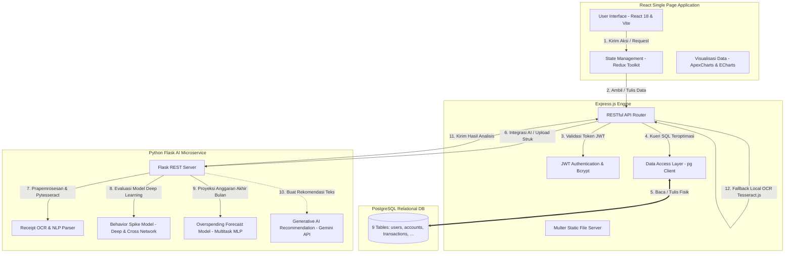

# SADAR Finance (Smart AI-Driven Automated Receipt & Finance Management)

SADAR Finance adalah aplikasi personal finance berbasis kecerdasan buatan (*AI-driven*) yang dirancang khusus untuk membantu individu memantau, menganalisis, dan mengendalikan keuangan pribadi secara sadar (*mindful*). 

Aplikasi ini mengintegrasikan pemrosesan citra struk digital otomatis menggunakan **Optical Character Recognition (OCR)** dan **Natural Language Processing (NLP)**, pemodelan perilaku belanja tak wajar dengan **Deep & Cross Network (DCN)**, serta proyeksi pembengkakan alokasi anggaran bulanan dengan **Multi-task Multi-Layer Perceptron (MLP)**.

---

## 🌟 Status Aplikasi

**SADAR Finance kini telah rampung 100% (Production-Ready).** Proyek ini menerapkan pendekatan arsitektur *Decoupled Full-Stack* yang terdiri atas tiga layanan mandiri:
1. **Frontend Web App**: Aplikasi SPA modern berbasis React 18, Vite 6, Redux Toolkit, dan Tailwind CSS v4 untuk antarmuka pengguna yang responsif.
2. **Backend RESTful API**: Layanan server tangguh berbasis Node.js, Express, dan database relasional PostgreSQL untuk autentikasi terenkripsi, pencatatan transaksi, histori OCR, dan agregasi data analitik.
3. **AI Microservice**: Engine analitik prediktif berbasis Python Flask, PyTesseract OCR, Pillow, dan TensorFlow Keras untuk mengeksekusi ekstraksi struk belanja dan model deep learning.

---

## 🗺️ Arsitektur Sistem

Berikut adalah visualisasi alur data dan interaksi antarsistem di SADAR Finance:



---

## 💎 Fitur Utama & Struktur Menu

SADAR Finance didesain dengan antarmuka bertema profesional dan elegan yang terdiri atas 5 menu navigasi utama pada sidebar:

### 1. Dashboard (`/dashboard`)
*   **Greeting Personal**: Sapaan dinamis berdasarkan profil pengguna aktif.
*   **Summary Cards (5 Metrik Utama)**: Menampilkan total saldo gabungan, akumulasi pemasukan bulan ini, akumulasi pengeluaran bulan ini, sisa anggaran saat ini, dan jumlah riwayat catatan keuangan.
*   **Cashflow Chart**: Visualisasi perbandingan pemasukan vs pengeluaran bulanan menggunakan diagram batang (ApexCharts).
*   **Expense Trend**: Tren perkembangan pengeluaran harian/mingguan untuk melacak puncak konsumsi.
*   **Spending Category**: Distribusi pembagian pengeluaran berdasarkan kategori utama dalam bentuk diagram donat (*donut chart*).
*   **Smart Insight & Predictive Spending Alert**: Rekomendasi AI dan peringatan dini apabila terdeteksi potensi pembengkakan anggaran.
*   **Recent Transactions**: Tabel berisi 5-10 transaksi pengeluaran terbaru.

### 2. Catat Keuangan (`/catat-keuangan`)
Memfasilitasi pencatatan data keuangan ke dalam dua tab terpisah:
*   **Tab Transaksi (Pengeluaran)**:
    *   *Metode Input Manual*: Pengguna mengisi manual nominal, tanggal, kategori, akun pembayaran, dan catatan.
    *   *Metode Upload Struk (OCR)*: Pengguna mengunggah gambar nota belanja. AI memproses gambar, mengekstrak data otomatis (merchant, tanggal, nominal, item), menampilkan pratinjau hasil, dan memicu *autofill* pada formulir transaksi yang dapat disunting kembali sebelum disimpan ke database `/transactions`.
*   **Tab Income (Pemasukan)**:
    *   Penginputan manual pemasukan uang berdasarkan sumber pemasukan (misal: Gaji, Freelance, Bonus) yang langsung dialokasikan ke salah satu akun keuangan pengguna untuk menambah saldo.

### 3. Behavior Insight (`/behavior-insight`)
Halaman analitik bersifat *read-only* untuk memberikan edukasi kebiasaan berbelanja pengguna:
*   **Weekend vs Weekday Behavior**: Membandingkan intensitas dan nominal pengeluaran di hari kerja melawan akhir pekan.
*   **Kategori Dominan**: Penilaian mendalam terhadap sektor pengeluaran terbesar yang menyerap porsi anggaran tertinggi.
*   **Rekomendasi Kebiasaan**: Saran taktis berbasis pola belanja historis agar pengguna dapat menghemat pengeluaran tidak produktif.

### 4. Financial Score (`/financial-score`)
*   **Skor Kesehatan (0-100)**: Indeks numerik kesehatan keuangan pengguna.
    *   `71 - 100`: **Sehat** (Warna Hijau)
    *   `41 - 70`: **Cukup Sehat** (Warna Jingga)
    *   `0 - 40`: **Perlu Perhatian** (Warna Merah)
*   **Faktor Pembentuk**: Evaluasi rasio tabungan, laju belanja, kepatuhan budget, konsistensi pencatatan, dan deviasi alokasi anggaran.
*   **Analisis Alokasi Budget 50/30/20**: Membandingkan pengeluaran riil terhadap formula manajemen keuangan ideal (50% Kebutuhan/Needs, 30% Keinginan/Wants, dan 20% Tabungan/Savings).

### 5. Profile & Account (`/profile-account` & `/profile-account/edit`)
*   **Profil Pengguna**: Manajemen informasi dasar (Nama, Kredensial Email, Pekerjaan, Alamat, dan Unggah Foto Profil).
*   **Kelola Akun Keuangan**: CRUD akun penyimpanan uang pengguna (Cash/Tunai, Bank, E-wallet) beserta nomor rekening/ponselnya.
*   **Atur Budget Bulanan**: Menetapkan pagu anggaran spesifik untuk kelompok alokasi *Needs*, *Wants*, dan *Savings/Investment*.
*   **Riwayat Transaksi Lengkap**: Rekapitulasi komprehensif seluruh histori transaksi belanja dan pemasukan dalam bentuk tabel tabular interaktif.

---

## 🧠 Modul AI & Machine Learning Deep Dive

Bagian krusial yang menggerakkan kecerdasan di SADAR Finance mencakup tiga model analitis canggih di AI Microservice:

### A. Receipt OCR & NLP Extraction
*   **Prapemrosesan Citra (Pillow)**: Konversi citra ke skala abu-abu (*grayscale*), peningkatan kontras dinamis sebesar `1.8x`, manipulasi filter penajaman (*sharpening*), serta penskalaan resolusi ke lebar target `600px` dan tinggi maksimum `1800px` untuk mengoptimalkan kejelasan teks.
*   **Ekstraksi Teks (pytesseract)**: Memanfaatkan Tesseract Engine dengan konfigurasi `--psm 6` (asumsi blok teks seragam) menggunakan multi-bahasa `ind+eng`.
*   **NLP Parser**: Algoritma pencocokan pola regex dan penandaan berbasis token untuk mengurai nama merchant, tanggal transaksi berformat ISO, daftar detail nama item dan harga masing-masing, serta nominal kalkulasi total belanja.

### B. Behavior Spike Prediction
*   **Pemodelan Deep & Cross Network (DCN)**: Model tabular deep learning berbasis TensorFlow Keras untuk memetakan hubungan non-linear yang rumit dari data pengeluaran (nominal, bulan, tanggal, minggu, status akhir pekan, rolling spending 7 hari terakhir, merchant, metode pembayaran, media pembayaran, hari, dan waktu).
*   **Lapisan Khusus (Cross-Feature Layer)**: Mengimplementasikan kalkulasi perkalian silang fitur numerik dan kategorikal tersemat (*embedded feature vectors*) pada setiap iterasi pelatihan untuk mendeteksi korelasi pola konsumsi anomali secara mendalam.
*   **Rekomendasi Generatif (Gemini API Integration)**: Apabila kunci API `GEMINI_API_KEY` dikonfigurasi, AI secara dinamis merangkum hasil prediksi probabilitas spike menjadi 1-2 kalimat saran keuangan taktis dalam Bahasa Indonesia menggunakan model LLM Gemini. Jika kunci kosong, sistem beralih otomatis ke *rule-based fallback* terstruktur.

### C. Overspending Forecast
*   **Multitask MLP dengan Residual Dense Blocks**: Jaringan saraf tiruan multi-tugas yang mengevaluasi input vektor numerik ukuran `61` untuk menghasilkan dua output sekaligus: probabilitas terjadinya overspending sebelum penutupan bulan dan estimasi nominal kelebihan belanja (*overspending amount*).
*   **Sigmoid Fallback**: Jika data kueri masukan untuk model tidak lengkap, sistem mengaktifkan model fallback berbasis aturan logika bisnis. Model ini memproyeksikan rata-rata belanja harian ke akhir bulan dan memetakan rasionya terhadap batas anggaran melalui fungsi logistik sigmoid (`1.0 / (1.0 + exp(-5.0 * (ratio - 1.0)))`) untuk menjamin kalkulasi probabilitas yang mulus dan konsisten.

---

## 🗄️ Skema Database

SADAR Finance menggunakan database PostgreSQL dengan 9 tabel terelasi yang dioptimasi menggunakan indeks pencarian pada kolom kunci tamu (*foreign keys*) dan penanda waktu (*timestamps*):

```
                                 +------------------+
                                 |      users       |
                                 +------------------+
                                 | PK | users_id    |
                                 +----+--------------+
                                        |  |  |
            +---------------------------+  |  +-----------------------------+
            |                              |                                |
            v                              v                                v
+------------------+             +------------------+             +------------------+
|     accounts     |             |     insights     |             |      alerts      |
+------------------+             +------------------+             +------------------+
| PK | account_id  |             | PK | insight_id  |             | PK | alert_id    |
| FK | user_id     |             | FK | user_id     |             | FK | user_id     |
+------------------+             +------------------+             +------------------+
    |         |
    |         +-----------------+
    v                           v
+------------------+    +------------------+             +------------------+
|   transactions   |    |     incomes      |             |      scores      |
+------------------+    +------------------+             +------------------+
| PK | transaction_id|  | PK | income_id   |             | PK | score_id    |
| FK | user_id     |    | FK | user_id     |             | FK | user_id     |
| FK | account_id  |    | FK | account_id  |             +------------------+
+------------------+    +------------------+
    ^                         ^
    |                         |
    |  +----------------------+
    |  |
+------------------+
|     budgets      |
+------------------+
| PK | budget_id   |
| FK | user_id     |
| FK | income_id   |
+------------------+
    ^
    | (opsional)
+------------------+
|    ocr_scans     |
+------------------+
| PK | ocr_id      |
| FK | user_id     |
| FK | transaction_id|
+------------------+
```

### Detail Kolom & Spesifikasi Tabel

#### 1. Tabel `users`
Menyimpan data akun utama pengguna. Kredensial sandi dienkripsi menggunakan *salt* bcrypt putaran `12`.
*   `users_id`: `UUID` (Primary Key, Default: `uuid_generate_v4()`)
*   `first_name`: `VARCHAR(100)` (Not Null)
*   `last_name`: `VARCHAR(100)` (Not Null)
*   `gender`: `VARCHAR(20)`
*   `email`: `VARCHAR(255)` (Unique, Not Null)
*   `password_hash`: `VARCHAR(255)` (Not Null)
*   `phone_number`: `VARCHAR(20)`
*   `date_of_birth`: `DATE`
*   `address`: `TEXT`
*   `profile_picture`: `TEXT`
*   `occupation`: `VARCHAR(100)`
*   `status`: `user_status` (Enum: `'active'`, `'inactive'`, `'suspended'`, Default: `'active'`)
*   `created_at` / `updated_at`: `TIMESTAMPTZ`

#### 2. Tabel `accounts`
Dompet digital atau rekening bank milik pengguna.
*   `account_id`: `UUID` (Primary Key, Default: `uuid_generate_v4()`)
*   `user_id`: `UUID` (Foreign Key -> `users(users_id)` ON DELETE CASCADE, Not Null)
*   `account_name`: `VARCHAR(100)` (Not Null)
*   `account_number`: `VARCHAR(50)`
*   `balance`: `DECIMAL(15, 2)` (Default: `0.00`)
*   `created_at` / `updated_at`: `TIMESTAMPTZ`

#### 3. Tabel `transactions`
Menyimpan detail pengeluaran harian pengguna.
*   `transaction_id`: `UUID` (Primary Key, Default: `uuid_generate_v4()`)
*   `user_id`: `UUID` (Foreign Key -> `users(users_id)` ON DELETE CASCADE, Not Null)
*   `account_id`: `UUID` (Foreign Key -> `accounts(account_id)` ON DELETE SET NULL)
*   `category_group`: `VARCHAR(100)` (Pengelompokan anggaran: `'Needs'`, `'Wants'`, `'Savings'`, `'Other'`)
*   `category_detail`: `VARCHAR(100)` (Kategori spesifik belanja, misal: `'Food & Dining'`, `'Transportation'`)
*   `transaction_date`: `TIMESTAMPTZ` (Default: `NOW()`, Not Null)
*   `description`: `TEXT`
*   `source`: `VARCHAR(100)` (Sumber input, misal: `'manual'`, `'ocr'`)
*   `amount`: `DECIMAL(15, 2)` (Check: `amount > 0`, Not Null)
*   `created_at`: `TIMESTAMPTZ`

#### 4. Tabel `incomes`
Riwayat pemasukan finansial pengguna.
*   `income_id`: `UUID` (Primary Key, Default: `uuid_generate_v4()`)
*   `user_id`: `UUID` (Foreign Key -> `users(users_id)` ON DELETE CASCADE, Not Null)
*   `account_id`: `UUID` (Foreign Key -> `accounts(account_id)` ON DELETE SET NULL)
*   `amount`: `DECIMAL(15, 2)` (Check: `amount > 0`, Not Null)
*   `income_date`: `TIMESTAMPTZ` (Default: `NOW()`, Not Null)
*   `source`: `VARCHAR(100)` (Nama pemasukan, misal: `'Gaji'`, `'Freelance'`)
*   `created_at`: `TIMESTAMPTZ`

#### 5. Tabel `budgets`
Alokasi pembagian limit keuangan bulanan.
*   `budget_id`: `UUID` (Primary Key, Default: `uuid_generate_v4()`)
*   `user_id`: `UUID` (Foreign Key -> `users(users_id)` ON DELETE CASCADE, Not Null)
*   `income_id`: `UUID` (Foreign Key -> `incomes(income_id)` ON DELETE SET NULL)
*   `needs_budget` / `needs_amount`: `DECIMAL(15, 2)` (Alokasi Kebutuhan)
*   `wants_budget` / `wants_amount`: `DECIMAL(15, 2)` (Alokasi Keinginan)
*   `investment_budget` / `investment_amount` / `savings_amount`: `DECIMAL(15, 2)` (Alokasi Tabungan)
*   `income_amount` / `budget_limit` / `limit_amount`: `DECIMAL(15, 2)` (Limit Anggaran Gabungan)
*   `percentage`: `DECIMAL(5, 2)`
*   `source`: `VARCHAR(100)`
*   `income_date`: `TIMESTAMPTZ`
*   `created_at`: `TIMESTAMPTZ`

#### 6. Tabel `insights`
Hasil kalkulasi engine AI mengenai pola pengeluaran belanja pengguna.
*   `insight_id`: `UUID` (Primary Key, Default: `uuid_generate_v4()`)
*   `user_id`: `UUID` (Foreign Key -> `users(users_id)` ON DELETE CASCADE, Not Null)
*   `title`: `VARCHAR(255)` (Not Null)
*   `description`: `TEXT`
*   `created_at`: `TIMESTAMPTZ`

#### 7. Tabel `alerts`
Riwayat alert pembengkakan anggaran (*overspending warning*).
*   `alert_id`: `UUID` (Primary Key, Default: `uuid_generate_v4()`)
*   `user_id`: `UUID` (Foreign Key -> `users(users_id)` ON DELETE CASCADE, Not Null)
*   `message`: `TEXT` (Not Null)
*   `alert_type`: `alert_type` (Enum: `'overspending'`, `'budget_exceeded'`, `'anomaly'`, `'reminder'`, `'info'`, Default: `'info'`)
*   `created_at`: `TIMESTAMPTZ`

#### 8. Tabel `scores`
Log pencatatan skor kesehatan finansial pengguna dari waktu ke waktu.
*   `score_id`: `UUID` (Primary Key, Default: `uuid_generate_v4()`)
*   `user_id`: `UUID` (Foreign Key -> `users(users_id)` ON DELETE CASCADE, Not Null)
*   `score`: `INTEGER` (Check: `score BETWEEN 0 AND 100`)
*   `created_at`: `TIMESTAMPTZ`

#### 9. Tabel `ocr_scans`
Tabel pencatatan audit pemrosesan gambar struk menggunakan OCR.
*   `ocr_id`: `UUID` (Primary Key, Default: `uuid_generate_v4()`)
*   `user_id`: `UUID` (Foreign Key -> `users(users_id)` ON DELETE CASCADE, Not Null)
*   `image_url`: `TEXT` (Not Null)
*   `image_data`: `BYTEA` (Menyimpan data biner gambar struk untuk menjamin persistensi gambar ketika di-deploy di cloud serverless seperti Railway yang bersifat ephemeral)
*   `original_name`: `VARCHAR(255)`
*   `mime_type`: `VARCHAR(50)`
*   `file_size`: `INTEGER`
*   `status`: `ocr_status` (Enum: `'pending'`, `'processing'`, `'completed'`, `'failed'`, Default: `'pending'`)
*   `raw_text`: `TEXT` (Hasil ekstraksi OCR mentah)
*   `parsed_data`: `JSONB` (Data terstruktur hasil parsing NLP)
*   `confidence`: `DECIMAL(5, 4)`
*   `transaction_id`: `UUID` (Foreign Key -> `transactions(transaction_id)` ON DELETE SET NULL)
*   `error_message`: `TEXT`
*   `processed_at` / `created_at`: `TIMESTAMPTZ`

---

## ⚙️ Skenario Integrasi Data & Autentikasi

Aplikasi web memiliki konfigurasi tingkat lanjut yang fleksibel untuk mempermudah transisi fase pengembangan, peninjauan demo, dan produksi melalui tiga opsi skenario data di file `.env` frontend:

```env
# Konfigurasi Skenario Integrasi di frontend/.env
VITE_SADAR_DATA_SCENARIO="mock-with-backend-auth" # Opsi: mock-with-backend-auth, backend-with-backend-auth, backend-only
VITE_DEFAULTAUTH="sadar" # Opsi: sadar, fake
```

### 1. Skenario `mock-with-backend-auth`
Skenario ideal untuk demonstrasi antarmuka yang cepat tanpa perlu mengisi database pengguna.
*   **Autentikasi**: *Real Backend Auth* (proses Login/Register diarahkan langsung ke REST API backend untuk verifikasi JWT asli dan pemuatan sesi `authUser`).
*   **Data Finansial**: *Mock Data* (data Dashboard, Grafik, Catat Keuangan, Behavior Insight, dan Financial Score dimuat dari berkas mockup lokal `frontend/src/pages/SadarShared/mockData.js`).
*   **Kredensial Login Bawaan**: `demo@sadarfinance.com` / `Demo@12345`.

### 2. Skenario `backend-with-backend-auth`
Skenario pengujian terintegrasi penuh (*End-to-End*).
*   **Autentikasi**: *Real Backend Auth* via JWT.
*   **Data Finansial**: *Real Database Data* (seluruh data transaksi, akun, anggaran, skor, dan insight bersumber langsung dari PostgreSQL via kueri Express REST API).

### 3. Skenario `backend-only`
Skenario mode produksi ketat (*Strict Production Mode*).
*   Mewajibkan koneksi murni ke server backend tanpa ada toleransi pembacaan skenario simulasi ataupun fallback fake-auth.

### Kredensial Tambahan untuk Mode Pengembang (Fake Auth)
Jika `VITE_DEFAULTAUTH=fake` diaktifkan, frontend akan mensimulasikan login secara independen di sisi klien:
*   **Email**: `aqyla@example.com`
*   **Password**: `123456`

---

## 🛠️ Spesifikasi Tech Stack

| Komponen | Pustaka & Teknologi | Deskripsi |
| :--- | :--- | :--- |
| **Frontend Core** | React 18, Vite 6, Redux Toolkit, React Router v7 | Pembangunan SPA interaktif, state global, dan perutean cepat. |
| **UI & Styling** | Tailwind CSS v4, Bootstrap 5, Reactstrap, Sass | Sistem tata letak modern, responsivitas grid, dan visualisasi premium. |
| **Charts** | ApexCharts, ECharts, Chart.js, react-apexcharts | Mesin perender grafik garis, donat, batang, dan radar secara interaktif. |
| **Backend Core** | Node.js (>=18), Express.js | Kerangka kerja web server RESTful API modular. |
| **Database Engine**| PostgreSQL 15+, pg (node-postgres) | Database relasional tangguh untuk persistensi data ACID. |
| **Security Layer** | JWT, bcryptjs, Helmet, Express Rate Limit, CORS | Proteksi endpoint, enkripsi searah, pencegahan DDoS, & kontrol akses origin. |
| **OCR Fallback** | tesseract.js | Pemrosesan citra struk lokal di backend jika AI microservice padam. |
| **AI Microservice** | Python 3.8+, Flask, PyTesseract, Pillow | Server mikro pengeksekusi OCR dan NLP ekstraksi teks struk belanja. |
| **ML Engine** | TensorFlow 2.18, NumPy, Pandas | Framework kompilasi, evaluasi, dan inferensi model DCN & MLP. |
| **Generative AI** | Google Generative AI (Gemini SDK) | Pembuat narasi teks rekomendasi finansial kontekstual otomatis. |

---

## 📂 Struktur Proyek

```
sadar-finance/
├── ai/                         # Python AI Microservice
│   ├── inference/              # Logika inferensi model (OCR, Behavior, Overspending)
│   ├── models/                 # Berkas biner model TensorFlow (.keras) & Metadata JSON
│   ├── preprocessing/          # Modul ekstraksi NLP struk belanja
│   ├── tmp_uploads/            # Folder penyimpanan struk sementara
│   ├── app.py                  # Entrypoint Flask Server
│   ├── behavior_model.py       # Kelas arsitektur DCN ter-registrasi
│   ├── requirements.txt        # Daftar dependensi Python
│   └── train_behavior.py       # Skrip pelatihan model perilaku belanja
├── backend/                    # Node.js Express Backend
│   ├── config/                 # Kunci DB, CORS, JWT, dan skema Swagger OpenAPI
│   ├── controllers/            # Modul logika penangan request API (CRUD & Auth)
│   ├── db/                     # Berkas inisialisasi migrasi tabel & seed data demo
│   ├── middlewares/            # Validator skema Joi, filter autentikasi, & error handler
│   ├── repositories/           # Akses langsung kueri SQL PostgreSQL
│   ├── routes/                 # Deklarasi router endpoints Express
│   ├── services/               # Logika bisnis inti & pemanggil API AI Microservice
│   ├── utils/                  # Helper response format & penangan error DB
│   ├── validators/             # Skema validasi request input body Joi
│   ├── uploads/                # Direktori penyimpanan fisik berkas struk
│   └── server.js               # Entrypoint Utama Backend Server
├── frontend/                   # React Vite Frontend SPA
│   ├── public/                 # Aset ikon dan media statis publik
│   ├── src/
│   │   ├── Components/         # Komponen UI global & berkas API client (`api.js`)
│   │   ├── Layouts/            # Tata letak global (Sidebar, Topbar, Footer)
│   │   ├── pages/              # Halaman SPA (SadarDashboard, SadarBehavior, dll)
│   │   ├── Routes/             # Konfigurasi perutean publik/terproteksi
│   │   ├── slices/             # Redux Slice autentikasi dan layout
│   │   ├── index.css           # Styling dasar global
│   │   ├── tailwind.css        # Konfigurasi direktif Tailwind v4
│   │   └── main.jsx            # Rendering root React klien
│   ├── tsconfig.json           # Setelan kompilasi TypeScript
│   └── vite.config.js          # Konfigurasi bundle Vite
├── data/                       # Dataset latih model & file uji coba (.png)
└── sadar-finance.md            # Dokumentasi rancangan sistem asli
```

---

## ⚡ Panduan Konfigurasi Variabel Lingkungan (.env)

Untuk menjalankan sistem secara lengkap, salin berkas contoh `.env.example` ke `.env` pada masing-masing subdirektori dan lengkapi nilainya:

### 1. Backend (`backend/.env`)
```env
NODE_ENV=development
PORT=3000

# PostgreSQL Configuration
DB_HOST=localhost
DB_PORT=5432
DB_NAME=sadar_finance
DB_USER=postgres
DB_PASSWORD=your_local_postgres_password  # Isi dengan kata sandi PostgreSQL lokal Anda
DB_SSL=false

# JWT Configuration
JWT_SECRET=your_super_secret_jwt_key_change_in_production
JWT_EXPIRES_IN=7d

# AI Microservice URL
AI_SERVICE_URL=http://localhost:5000
AI_SERVICE_TIMEOUT_MS=10000
AI_MOCK_MODE=false # Set true untuk mensimulasikan hasil model tanpa memicu Flask server

# Rate Limiting
RATE_LIMIT_WINDOW_MS=900000
RATE_LIMIT_MAX=600

# File Upload Configuration
MAX_FILE_SIZE_MB=10
UPLOAD_DIR=uploads
```

### 2. AI Microservice (`ai/.env`)
```env
PORT=5000
GOOGLE_API_KEY=your_gemini_api_key_here  # Opsional: Untuk membuat saran finansial Generative AI
GENERATIVE_AI_MODEL=gemini-3.1-flash-lite
OCR_TIMEOUT_SECONDS=15
OCR_TARGET_WIDTH=600
OCR_MAX_HEIGHT=1800

# Lokasi Tesseract OCR Engine di Windows (Penting)
TESSERACT_CMD=C:\Program Files\Tesseract-OCR\tesseract.exe
```

### 3. Frontend (`frontend/.env`)
```env
VITE_DEFAULTAUTH=sadar # Pilihan: sadar (Backend), fake (Simulasi Klien)
VITE_API_URL=http://localhost:3000/api/v1
VITE_AI_URL=http://localhost:5000

# Skenario Data Utama
VITE_SADAR_DATA_SCENARIO="mock-with-backend-auth" # Pilihan: mock-with-backend-auth, backend-with-backend-auth, backend-only
VITE_SADAR_DEMO_MODE=true
VITE_SADAR_NEW_USER_PREVIEW=false
```

---

## 🚀 Panduan Memulai Proyek

### Prasyarat Perangkat Keras & Lunak
*   **Node.js** (Versi LTS >= 18) & npm.
*   **PostgreSQL** (Versi >= 15) terpasang lokal.
*   **Python** (Versi >= 3.8) beserta virtual environment (`venv`).
*   **Tesseract OCR Engine** terpasang di sistem operasi Anda.

#### Pemasangan Tesseract OCR Engine:
*   **Windows**:
    Unduh dan jalankan installer resmi dari UB-Mannheim. Atau pasang via terminal:
    ```powershell
    winget install --id UB-Mannheim.TesseractOCR -e
    ```
    Secara default, engine akan terpasang di `C:\Program Files\Tesseract-OCR\tesseract.exe`. Pastikan jalur ini diisi pada variabel `TESSERACT_CMD` di file `ai/.env`.
*   **macOS**:
    ```bash
    brew install tesseract tesseract-lang
    ```
*   **Linux (Ubuntu/Debian)**:
    ```bash
    sudo apt update
    sudo apt install tesseract-ocr tesseract-ocr-ind
    ```

---

### Langkah Penyiapan & Menjalankan Aplikasi

Jalankan 3 terminal terpisah untuk menghidupkan ekosistem SADAR Finance secara simultan:

#### Terminal 1: REST API Backend & Database
1.  Masuk ke direktori backend dan pasang dependensi:
    ```bash
    cd backend
    npm install
    ```
2.  Pastikan PostgreSQL Anda aktif, buat database kosong bernama `sadar_finance` via pgAdmin atau shell psql:
    ```sql
    CREATE DATABASE sadar_finance;
    ```
3.  Jalankan kueri pembuatan tabel (Migrasi) dan pengisian data uji coba awal (Seeding):
    ```bash
    npm run db:migrate
    npm run db:seed
    ```
4.  Aktifkan server backend dalam mode pengembang:
    ```bash
    npm run dev
    ```
    *   **Server aktif di**: `http://localhost:3000`
    *   **Swagger API Docs**: `http://localhost:3000/api-docs`

#### Terminal 2: AI Microservice
1.  Masuk ke direktori AI dan buat virtual environment Python:
    ```bash
    cd ai
    python -m venv venv
    ```
2.  Aktifkan lingkungan virtual:
    *   *Windows (Command Prompt / PowerShell)*:
        ```powershell
        venv\Scripts\activate
        ```
    *   *macOS / Linux*:
        ```bash
        source venv/bin/activate
        ```
3.  Pasang dependensi pustaka Python:
    ```bash
    pip install -r requirements.txt
    ```
4.  Aktifkan server Flask AI:
    ```bash
    python app.py
    ```
    *   **Layanan aktif di**: `http://localhost:5000`
    *   **Verifikasi Kesehatan Layanan**: `curl http://localhost:5000/health`

#### Terminal 3: Frontend SPA
1.  Masuk ke direktori frontend dan pasang dependensi Node modules:
    ```bash
    cd frontend
    npm install
    ```
2.  Jalankan server Vite lokal:
    ```bash
    npm run dev
    ```
    *   **Layanan web aktif di**: `http://localhost:5173`

Buka peramban browser Anda ke `http://localhost:5173` untuk mulai menjelajahi SADAR Finance.

---

## 🔎 Penanganan Kendala (Troubleshooting)

*   **Error: "TesseractError" / "pytesseract.TesseractNotFoundError"**:
    *   Penyebab: Python tidak dapat menemukan berkas biner Tesseract OCR.
    *   Solusi: Pastikan Tesseract telah terpasang dengan benar di sistem Anda. Buka berkas `ai/.env` dan verifikasi kembali bahwa variabel `TESSERACT_CMD` menunjuk tepat ke berkas `tesseract.exe` (misalnya: `C:\Program Files\Tesseract-OCR\tesseract.exe` pada Windows). Setelah melakukan perubahan `.env`, restart terminal Flask AI.
*   **Koneksi Database PostgreSQL Gagal**:
    *   Penyebab: Kredensial password atau port database di `backend/.env` tidak tepat.
    *   Solusi: Jalankan skrip diagnostik mandiri dari backend untuk memverifikasi detail koneksi database:
        ```bash
        npm run db:check
        ```
*   **Tombol "Proses OCR" Tidak Merespons / Mengalami Timeout**:
    *   Solusi: 
        1. Pastikan server Flask AI di terminal 2 menyala di port `5000`.
        2. Pastikan Anda telah melakukan proses login (sesi aktif) sebelum memicu fallback lokal OCR backend, karena endpoint `/ocr/upload` backend memerlukan otorisasi token Bearer JWT yang valid.

---

## 👥 Tim Pengembang SADAR Finance

Proyek sistem cerdas ini dikembangkan oleh kolaborasi lintas peran dari **SADAR Finance Team**:

1.  **Diah Ayu Puspasari** (CDCC156D6X1244) - *Data Scientist*
2.  **Marsela** (CDCC156D6X028) - *Data Scientist*
3.  **Farrel Al Faqih Ekatama** (CACC295D6Y0695) - *AI Engineer*
4.  **Dzaky Jaisy Al-Qorney** (CACC349D6Y1657) - *AI Engineer*
5.  **Fhazar Raffiful Aqyla** (CFCC882D6Y0583) - *Full Stack Developer*
6.  **Muhammad Habib Rafi** (CFCC220D6Y1309) - *Full Stack Developer*

---

## 📚 Tautan & Sumber Daya Referensi
*   [Dokumentasi React 18](https://react.dev/)
*   [Panduan Vite.js](https://vite.dev/)
*   [Dokumentasi Express.js](https://expressjs.com/)
*   [PostgreSQL 15 Manual](https://www.postgresql.org/docs/15/index.html)
*   [TensorFlow Keras Guide](https://www.tensorflow.org/guide/keras)
*   [Swagger OpenAPI Spec](https://swagger.io/docs/)
*   [Pytesseract OCR Engine](https://github.com/madmaze/pytesseract)
