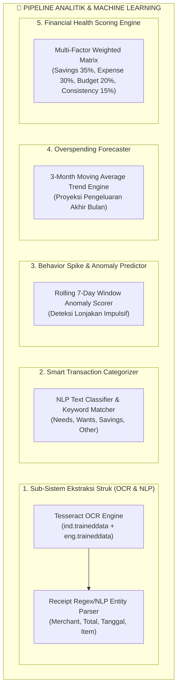
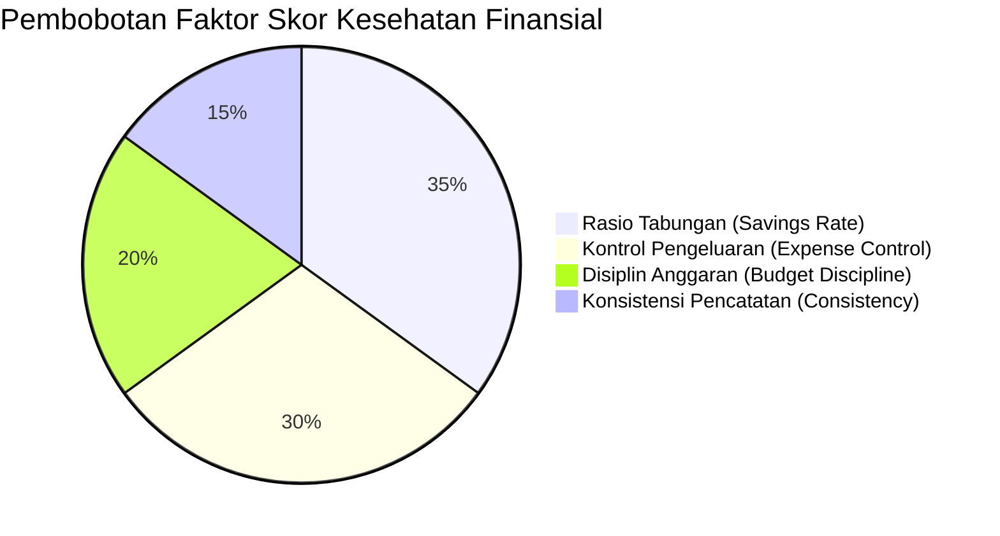
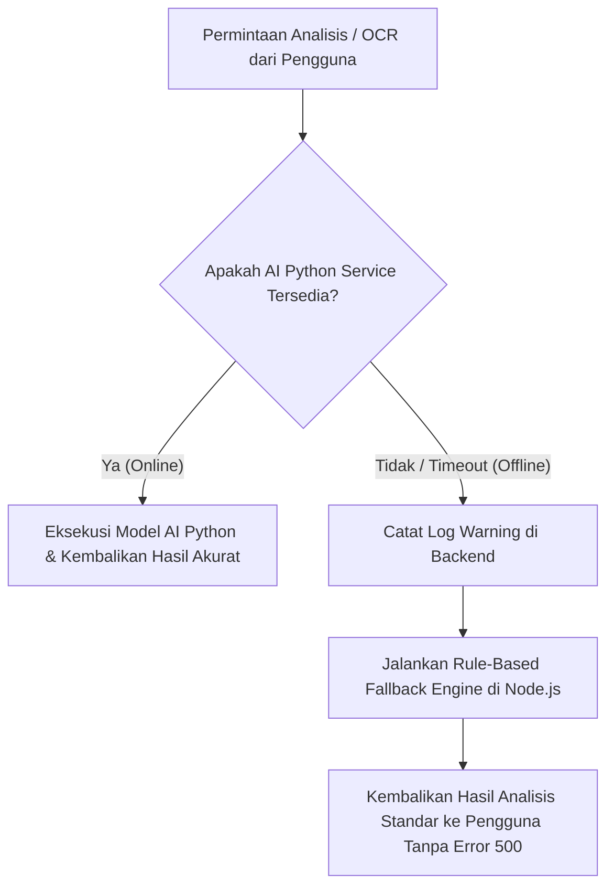

# Spesifikasi Kecerdasan Buatan (AI & ML)
# SADAR Finance — Machine Learning & Analytics Pipeline

| Versi Dokumen | Status | Bahasa Utama | Engine & Framework |
|---|---|---|---|
| **v1.0.0** | **Production-Ready** | **Python 3.11 / Node.js** | **Tesseract OCR, Scikit-Learn, RegEx NLP** |

---

## 1. Filosofi & Pendekatan AI (*AI Philosophy*)

SADAR Finance menerapkan pendekatan **"Pragmatic & Non-Intrusive Artificial Intelligence"**:

1. **AI sebagai Pendukung Keputusan (*Decision Support System*)**:
   - AI difungsikan untuk mengotomatiskan pekerjaan yang membosankan (seperti membaca struk belanja) dan memberikan analisis yang objektif (skor kesehatan, peringatan dini, klasifikasi kategori).
2. **Tanpa Bising Visual (*Zero Visual Noise*)**:
   - Tidak ada asisten virtual bergerak yang menutupi layar atau chatbot percakapan bertele-tele. Semua output AI berbentuk kartu ringkas, angka terukur, dan badge status.
3. **Resiliensi Berlapis (*Dual-Layer Fallback Architecture*)**:
   - Sistem dirancang tahan banting (*fault-tolerant*). Jika microservice Python mengalami gangguan, backend Node.js secara otomatis mengeksekusi algoritma *rule-based & heuristic fallback* tanpa menginterupsi pengguna.

---

## 2. Peta Sub-Sistem AI (*AI Subsystem Map*)



---

## 3. Rincian Modul Kecerdasan Buatan

### 3.1 Modul 1: Ekstraksi Data Struk Belanja (*Receipt OCR & NLP*)

Modul ini bertanggung jawab mengubah foto struk belanja fisik dari toko swalayan, kafe, atau restoran menjadi data JSON terstruktur:

#### Alur Ekstraksi Struk
1. **Pre-processing Gambar**:
   - Binarization, grayscale conversion, dan noise removal pada gambar masukan.
2. **Text Recognition (OCR)**:
   - Tesseract membaca teks baris demi baris menggunakan kamus bahasa Indonesia dan Inggris.
3. **NLP Entity Parser**:
   - **Pencarian Merchant**: Mengidentifikasi nama merchant di 3 baris teratas (contoh: *Indomaret, Alfamart, Starbucks, Kopi Kenangan*).
   - **Pencarian Total Nominal**: RegEx mengenali pola nominal terbesar yang diawali kata kunci `TOTAL`, `GRAND TOTAL`, `HARGA JUAL`, atau `TUNAI / DEBIT`.
   - **Pencarian Tanggal**: RegEx mendeteksi format tanggal umum Indonesia (`DD/MM/YYYY`, `DD-MM-YYYY`, `DD MMM YYYY`).
   - **Ekstraksi Item Belanja**: Memilah baris harga dan nama produk secara individual.

```json
// Contoh Output JSON Terstruktur Hasil OCR
{
  "merchant": "INDOMARET",
  "total_amount": 54500,
  "date": "2026-05-10",
  "suggested_category_group": "Needs",
  "suggested_category_detail": "Belanja Kebutuhan Harian",
  "confidence": 0.92,
  "items": [
    { "name": "ULTRA MILK 1L", "price": 21000 },
    { "name": "ROTI TAWAR SARI ROTI", "price": 16500 },
    { "name": "TELUR AYAM 10 BUTIR", "price": 17000 }
  ]
}
```

---

### 3.2 Modul 2: Smart Transaction Categorizer

Mengelompokkan transaksi baru secara otomatis berdasarkan deskripsi teks atau nama merchant:

| Kategori Makro | Kata Kunci Pola Deteksi | Kategori Detail Standar |
|---|---|---|
| **Needs (Kebutuhan Pokok)** | `makan, warung, indomaret, alfamart, beras, sayur, listrik, air, pdam, pulsa, bensin, spbu, obat, apotek, dokter, spp, sekolah` | Makanan Pokok, Tagihan & Utilitas, Transportasi, Kesehatan, Pendidikan |
| **Wants (Gaya Hidup / Sekunder)** | `kopi, cafe, resto, mall, nonton, bioskop, netflix, spotify, game, fashion, baju, shopee, belanja, liburan` | Hiburan, Kuliner Santai, Belanja Sekunder, Hobi |
| **Savings / Investment** | `tabungan, reksadana, bibit, bareksa, saham, ajaib, emas, deposito, transfer masuk tabungan` | Tabungan Dana Darurat, Investasi Pasar Modal |
| **Other** | Transaksi yang tidak cocok dengan pola kata kunci utama | Lain-lain |

---

### 3.3 Modul 3: Deteksi Anomali Lonjakan Transaksi (*Spike Predictor*)

Mengevaluasi apakah nominal suatu transaksi baru tergolong wajar atau berisiko mengganggu kestabilan keuangan pengguna:

- **Fitur Input**:
  - `amount`: Nominal transaksi baru.
  - `rolling7dSpending`: Total akumulasi pengeluaran pengguna selama 7 hari terakhir.
  - `categoryPrimary`: Kategori pos pengeluaran (`Needs`, `Wants`, `Savings`).
- **Logika Kalkulasi Probabilitas Lonjakan (*Spike Probability*)**:
  $$\text{Ratio} = \frac{\text{amount}}{\text{rolling7dSpending}}$$
  $$\text{Spike Probability} = \begin{cases} 
  0.78, & \text{jika } \text{amount} \ge Rp 1.000.000 \\ 
  0.55, & \text{jika } \text{amount} \ge Rp 500.000 \text{ atau } \text{Ratio} \ge 0.50 \\ 
  0.24, & \text{lainnya} 
  \end{cases}$$
- **Tingkat Risiko (*Risk Level*)**:
  - `high` (Probabilitas $\ge 0.70$): Menampilkan rekomendasi untuk meninjau ulang prioritas sebelum membeli.
  - `medium` (Probabilitas $0.40 - 0.69$): Peringatan untuk menjaga pengeluaran harian tetap terkendali.
  - `low` (Probabilitas $< 0.40$): Transaksi berada dalam rentang wajar.

---

### 3.4 Modul 4: Prediksi Overspending Akhir Bulan (*Forecasting Engine*)

Memproyeksikan potensi pembengkakan anggaran sebelum periode kalender berakhir:

1. **Moving Average Tren Pengeluaran**:
   - Menghitung rata-rata pengeluaran bulanan dari 3 bulan terakhir ($AvgExpense$).
2. **Proyeksi Akhir Bulan**:
   $$PredictedAmount = AvgExpense \times 1.10$$
3. **Evaluasi Terhadap Batas Anggaran ($BudgetLimit$)**:
   $$Ratio = \frac{PredictedAmount}{BudgetLimit}$$
   - **Kritis / Critical ($Ratio > 1.30$)**: Pengeluaran diproyeksikan membengkak lebih dari 30% di atas anggaran.
   - **Tinggi / High ($Ratio > 1.10$)**: Pengeluaran diproyeksikan melebihi budget.
   - **Waspada / Medium ($Ratio > 0.90$)**: Pengeluaran mendekati 90% dari batas budget.
4. **Output Tindakan**: Sistem otomatis menuliskan entri baru ke tabel `alerts` dan menampilkan banner notifikasi di Dashboard.

---

### 3.5 Modul 5: Algoritma Skor Kesehatan Finansial (*Financial Health Score*)

Skor komprehensif 0–100 yang dievaluasi secara objektif dari data riil 3 bulan terakhir:

$$\text{Overall Health Score} = (\text{Savings Score} \times 0.35) + (\text{Expense Score} \times 0.30) + (\text{Budget Score} \times 0.20) + (\text{Consistency Score} \times 0.15)$$



#### Rincian Sub-Skor
1. **Savings Score (Bobot 35%)**:
   - Dihitung dari $\text{Savings Rate} = \frac{\text{Total Income} - \text{Total Expense}}{\text{Total Income}}$.
   - Jika $\text{Savings Rate} \ge 20\% \implies \text{Score} = 100$.
   - Jika $< 20\% \implies \text{Score} = \text{clamp}\left(\frac{\text{Savings Rate}}{0.20} \times 100\right)$.
2. **Expense Score (Bobot 30%)**:
   - Dihitung dari $\text{Expense Ratio} = \frac{\text{Total Expense}}{\text{Total Income}}$.
   - Jika $\text{Expense Ratio} \le 70\% \implies \text{Score} = 100$.
   - Jika $70\% < \text{Ratio} \le 100\% \implies \text{Score} = 100 - \left(\frac{\text{Ratio} - 0.70}{0.30} \times 50\right)$.
   - Jika $> 100\% \implies \text{Score} = 50 - \left(\frac{\text{Ratio} - 1.00}{0.30} \times 50\right)$.
3. **Budget Discipline Score (Bobot 20%)**:
   - Dihitung dari $\text{Budget Usage} = \frac{\text{Total Expense}}{\text{Budget Limit}}$.
   - Jika $\text{Budget Usage} \le 80\% \implies \text{Score} = 100$.
   - Jika $80\% < \text{Usage} \le 100\% \implies \text{Score} = 100 - \left(\frac{\text{Usage} - 0.80}{0.20} \times 40\right)$.
4. **Consistency Score (Bobot 15%)**:
   - Persentase kelengkapan data pencatatan transaksi selama periode evaluasi.

---

## 4. Mekanisme Fallback & Ketahanan Sistem


