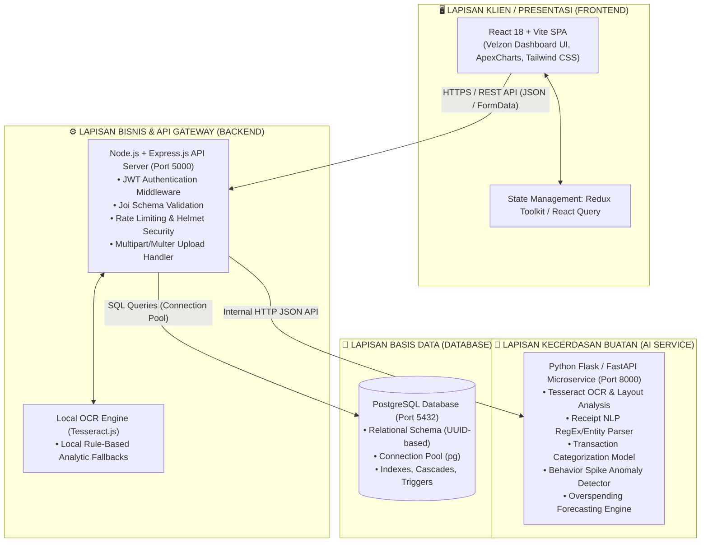
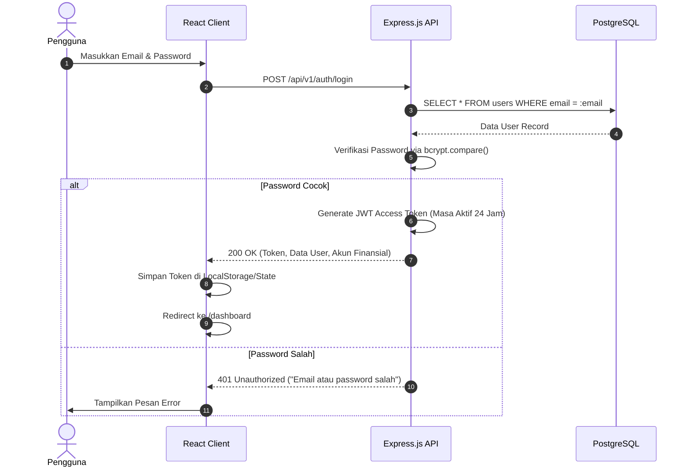
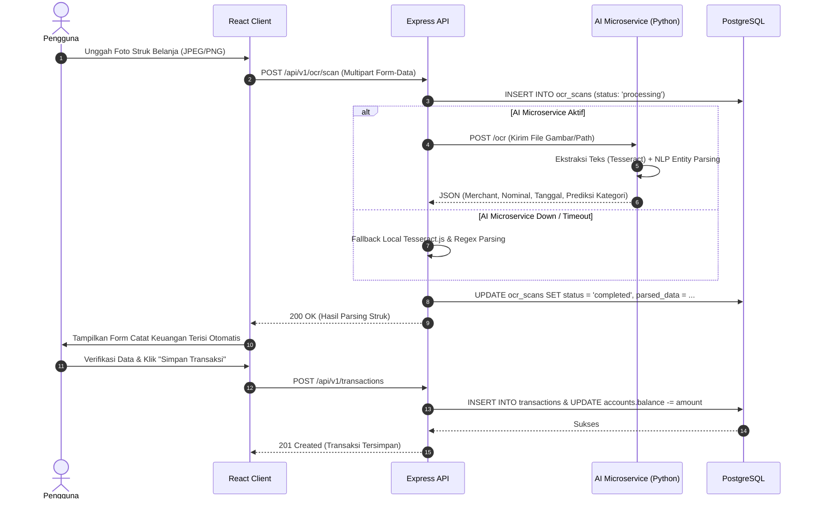
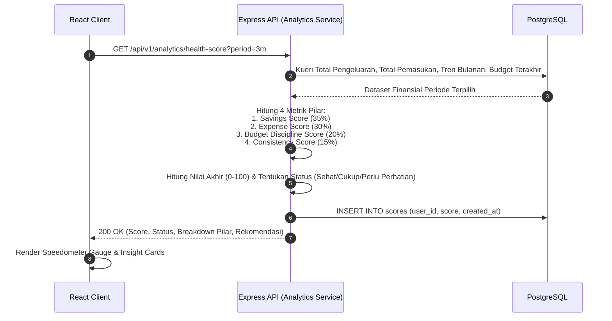
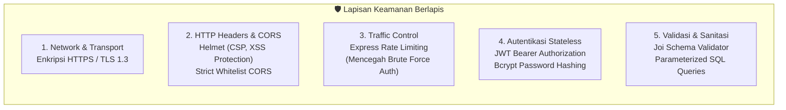
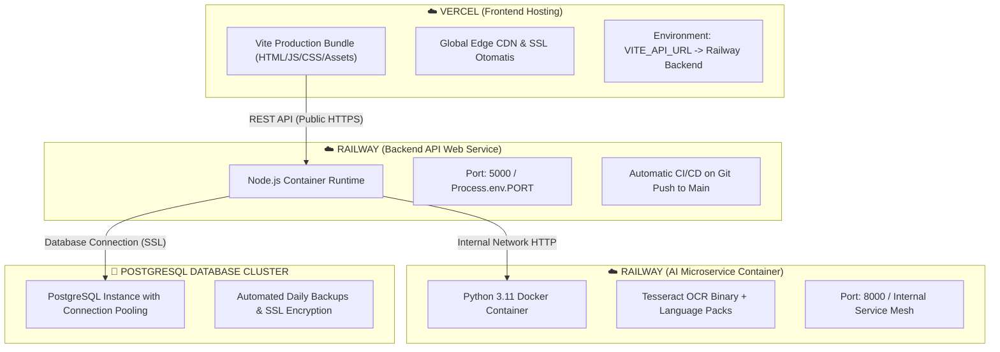

# Spesifikasi Arsitektur Sistem
# SADAR Finance — Smart AI-Driven Personal Finance Platform

| Versi Dokumen | Status | Terakhir Diperbarui | Target Lingkungan |
|---|---|---|---|
| **v1.0.0 (Production-Ready)** | **Approved** | **Agustus 2026** | **Hybrid / Cloud (Vercel + Railway + PostgreSQL)** |

---

## 1. Gambaran Umum Arsitektur (*Architectural Overview*)

SADAR Finance mengadopsi pola arsitektur **3-Tier Microservices Decoupled** yang memisahkan lapisan presentasi (*Frontend Client*), lapisan logika bisnis & API (*Backend Service*), lapisan komputasi kecerdasan buatan (*AI Microservice*), dan lapisan penyimpanan data (*Relational Database*).

Pemisahan ini memastikan performa tinggi, skalabilitas independen, isolasi error (*fault isolation*), dan fleksibilitas *tech stack*.

---

## 2. Rincian Teknologi (*Technology Stack Breakdown*)

### 2.1 Frontend Tier
- **Framework & Build Tool**: React 18.3+, Vite 6.x (Fast HMR & Optimized Bundler).
- **UI System & Styling**: Velzon Theme System, Bootstrap 5.3 + Tailwind CSS 4.x utility classes, SASS/SCSS.
- **Visualisasi & Grafik**: ApexCharts (`react-apexcharts`), Chart.js, ECharts untuk speedometer & visualisasi tren.
- **State & Data Fetching**: Redux Toolkit, Context API, Axios dengan interceptor token JWT otomatis.
- **Ikonografi & Animasi**: Lucide React, Feather Icons, Remix Icons, Framer Motion.
- **Hosting / Deployment**: Vercel Serverless Edge Network.

### 2.2 Backend API Tier
- **Runtime & Framework**: Node.js (>= v18 LTS), Express.js v4.21+.
- **Autentikasi & Keamanan**: JSON Web Token (`jsonwebtoken`), `bcryptjs` (hashing password), `helmet` (security headers), `express-rate-limit`, `cors`.
- **Validasi Data**: `joi` v17+ untuk validasi skema payload permintaan secara ketat.
- **Penanganan File Struk**: `multer` untuk upload multipart/form-data sementara.
- **Database Driver**: `pg` (Node-Postgres Connection Pool).
- **Dokumentasi API Terpasang**: Swagger UI Express (`/api/docs`).
- **Hosting / Deployment**: Railway / Render Web Service.

### 2.3 AI & Machine Learning Tier
- **Bahasa & Runtime**: Python 3.10+ / 3.11.
- **Framework Web AI**: Flask / FastAPI dengan ekstensi CORS.
- **OCR & Computer Vision**: Tesseract OCR (dengan data latih `ind.traineddata` & `eng.traineddata`).
- **Pemrosesan Teks & ML**: Scikit-Learn, Pandas, NumPy, RegEx NLP Parser untuk struk kasir Indonesia.
- **Hosting / Deployment**: Railway Docker Containerized Service.

### 2.4 Database Tier
- **DBMS**: PostgreSQL v15+ / v16+.
- **Fitur Utama**: Ekstensi `uuid-ossp` untuk kunci primer UUID v4, ENUM types (`user_status`, `alert_type`, `ocr_status`), transactional query support (`BEGIN ... COMMIT / ROLLBACK`), dan indeks performa komposit.

---

## 3. Alur Data Utama (*Core Data Flow Pipelines*)

### 3.1 Alur Autentikasi Pengguna (*User Authentication Flow*)

---

### 3.2 Alur Pemrosesan Scan Struk OCR (*AI Receipt OCR Processing Flow*)

---

### 3.3 Alur Kalkulasi Skor Kesehatan Keuangan (*Financial Health Score Flow*)

---

## 4. Keamanan & Kebijakan Sistem (*Security Architecture*)

1. **Autentikasi Stateless Berbasis JWT**:
   - Header permintaan: `Authorization: Bearer <jwt_token>`.
   - Token ditandatangani menggunakan `JWT_SECRET` yang aman dan memiliki masa kedaluwarsa terukur.
2. **Perlindungan Terhadap Serangan Siber**:
   - **SQL Injection**: Seluruh interaksi database menggunakan kueri berparameter (*parameterized queries* `$1, $2, ...`), tidak pernah melakukan *string concatenation*.
   - **Cross-Site Scripting (XSS)**: Header `Helmet` mengaktifkan `X-XSS-Protection`, `X-Content-Type-Options: nosniff`, dan pembatasan `Content-Security-Policy`.
   - **Brute Force Protection**: Rate limiting membatasi percobaan login/register maksimal 10 kali per 15 menit per alamat IP.
3. **Isolasi Multi-Tenancy**:
   - Setiap operasi modifikasi dan pembacaan data wajib diverifikasi kepemilikannya terhadap `req.user.userId`. Pengguna tidak dapat mengakses data pengguna lain.

---

## 5. Strategi Deployment & Infrastruktur (*Deployment Architecture*)

- **Frontend (Vercel)**:
  - Konfigurasi rewrite SPA via `vercel.json` agar seluruh rute diarahkan ke `index.html`.
  - Kompilasi aset teroptimasi dengan *Gzip/Brotli compression*.
- **Backend & AI (Railway)**:
  - Backend berjalan di container Node.js dengan zero-downtime deployment.
  - AI Service berjalan dalam container Docker terpisah dengan binary Tesseract terpasang.
- **Database (PostgreSQL)**:
  - Database terisolasi dengan koneksi aman via SSL/TLS.
