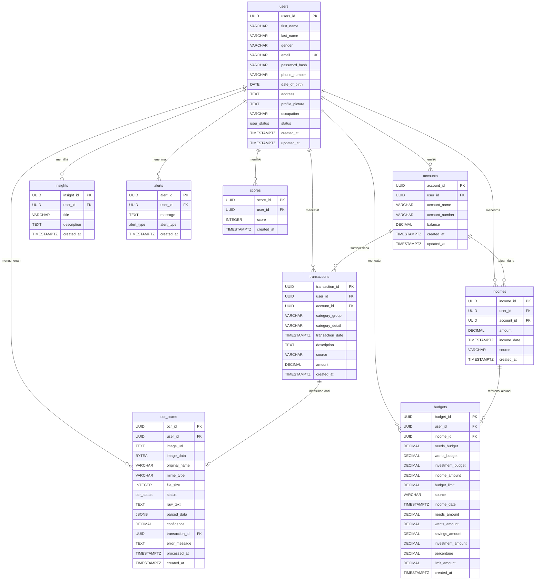

# Spesifikasi Skema Basis Data & ERD
# SADAR Finance — PostgreSQL Database Architecture

| Versi Dokumen | Target DBMS | Format Kunci Primer | Terakhir Diperbarui |
|---|---|---|---|
| **v1.0.0** | **PostgreSQL 15+** | **UUID v4 (`uuid-ossp`)** | **Agustus 2026** |

---

## 1. Entity-Relationship Diagram (ERD)

Diagram relasi entitas basis data SADAR Finance yang menghubungkan pengguna, akun keuangan, mutasi transaksi pengeluaran & pemasukan, alokasi anggaran, analitik AI, serta pemindaian struk:



---

## 2. Definisi Tipe Enum (*Custom ENUM Types*)

```sql
-- Status Akun Pengguna
CREATE TYPE user_status AS ENUM ('active', 'inactive', 'suspended');

-- Tipe Peringatan Cerdas / Alert
CREATE TYPE alert_type AS ENUM ('overspending', 'budget_exceeded', 'anomaly', 'reminder', 'info');

-- Status Pemrosesan OCR Struk
CREATE TYPE ocr_status AS ENUM ('pending', 'processing', 'completed', 'failed');
```

---

## 3. Kamus Data Lengkap (*Comprehensive Data Dictionary*)

### 3.1 Tabel `users`
Menyimpan identitas profil, kredensial autentikasi, dan status akun pengguna.

| Nama Kolom | Tipe Data | Nullable | Default | Keterangan & Batasan |
|---|---|---|---|---|
| `users_id` | `UUID` | No | `uuid_generate_v4()` | **Primary Key** |
| `first_name` | `VARCHAR(100)` | No | - | Nama depan pengguna |
| `last_name` | `VARCHAR(100)` | No | - | Nama belakang / keluarga |
| `gender` | `VARCHAR(20)` | Yes | `NULL` | Jenis kelamin ('Laki-laki', 'Perempuan') |
| `email` | `VARCHAR(255)` | No | - | **Unique**, alamat email untuk login |
| `password_hash` | `VARCHAR(255)` | No | - | Hash kata sandi menggunakan Bcrypt |
| `phone_number` | `VARCHAR(20)` | Yes | `NULL` | Nomor telepon/WhatsApp |
| `date_of_birth` | `DATE` | Yes | `NULL` | Tanggal lahir |
| `address` | `TEXT` | Yes | `NULL` | Alamat domisili |
| `profile_picture` | `TEXT` | Yes | `NULL` | URL/Path avatar profil |
| `occupation` | `VARCHAR(100)` | Yes | `NULL` | Profesi / pekerjaan pengguna |
| `status` | `user_status` | Yes | `'active'` | Status pengguna (`active`, `inactive`, `suspended`) |
| `created_at` | `TIMESTAMPTZ` | Yes | `NOW()` | Waktu pendaftaran |
| `updated_at` | `TIMESTAMPTZ` | Yes | `NOW()` | Waktu update terakhir |

---

### 3.2 Tabel `accounts`
Menyimpan data dompet fisik, rekening bank, dan dompet digital (*e-wallet*) milik pengguna.

| Nama Kolom | Tipe Data | Nullable | Default | Keterangan & Batasan |
|---|---|---|---|---|
| `account_id` | `UUID` | No | `uuid_generate_v4()` | **Primary Key** |
| `user_id` | `UUID` | No | - | **Foreign Key** `users(users_id)` ON DELETE CASCADE |
| `account_name` | `VARCHAR(100)` | No | - | Nama akun (contoh: "BCA Utama", "GoPay", "Dompet Tunai") |
| `account_number` | `VARCHAR(50)` | Yes | `NULL` | Nomor rekening / nomor e-wallet |
| `balance` | `DECIMAL(15, 2)` | Yes | `0` | Saldo aktual akun dalam Rupiah |
| `created_at` | `TIMESTAMPTZ` | Yes | `NOW()` | Waktu pembuatan akun |
| `updated_at` | `TIMESTAMPTZ` | Yes | `NOW()` | Waktu perubahan saldo/informasi |

---

### 3.3 Tabel `transactions`
Menyimpan setiap mutasi pengeluaran finansial pengguna.

| Nama Kolom | Tipe Data | Nullable | Default | Keterangan & Batasan |
|---|---|---|---|---|
| `transaction_id` | `UUID` | No | `uuid_generate_v4()` | **Primary Key** |
| `user_id` | `UUID` | No | - | **Foreign Key** `users(users_id)` ON DELETE CASCADE |
| `account_id` | `UUID` | Yes | `NULL` | **Foreign Key** `accounts(account_id)` ON DELETE SET NULL |
| `category_group` | `VARCHAR(100)` | Yes | `NULL` | Kategori makro: `'Needs'`, `'Wants'`, `'Savings'`, `'Other'` |
| `category_detail` | `VARCHAR(100)` | Yes | `NULL` | Kategori detail (contoh: "Makanan & Minuman", "Transportasi") |
| `transaction_date`| `TIMESTAMPTZ` | No | `NOW()` | Waktu transaksi dilakukan |
| `description` | `TEXT` | Yes | `NULL` | Catatan transaksi atau nama merchant |
| `source` | `VARCHAR(100)` | Yes | `NULL` | Sumber pencatatan ('manual', 'ocr_scan') |
| `amount` | `DECIMAL(15, 2)` | No | - | Nominal pengeluaran (**CHECK amount > 0**) |
| `created_at` | `TIMESTAMPTZ` | Yes | `NOW()` | Waktu pencatatan ke sistem |

---

### 3.4 Tabel `incomes`
Menyimpan mutasi pemasukan uang pengguna.

| Nama Kolom | Tipe Data | Nullable | Default | Keterangan & Batasan |
|---|---|---|---|---|
| `income_id` | `UUID` | No | `uuid_generate_v4()` | **Primary Key** |
| `user_id` | `UUID` | No | - | **Foreign Key** `users(users_id)` ON DELETE CASCADE |
| `account_id` | `UUID` | Yes | `NULL` | **Foreign Key** `accounts(account_id)` ON DELETE SET NULL |
| `amount` | `DECIMAL(15, 2)` | No | - | Nominal pemasukan (**CHECK amount > 0**) |
| `income_date` | `TIMESTAMPTZ` | No | `NOW()` | Waktu pemasukan diterima |
| `source` | `VARCHAR(100)` | Yes | `NULL` | Sumber pemasukan (contoh: "Gaji", "Bonus", "Freelance") |
| `created_at` | `TIMESTAMPTZ` | Yes | `NOW()` | Waktu pencatatan ke sistem |

---

### 3.5 Tabel `budgets`
Menyimpan konfigurasi alokasi anggaran bulanan pengguna (metode 50/30/20 & per kategori).

| Nama Kolom | Tipe Data | Nullable | Default | Keterangan |
|---|---|---|---|---|
| `budget_id` | `UUID` | No | `uuid_generate_v4()` | **Primary Key** |
| `user_id` | `UUID` | No | - | **Foreign Key** `users(users_id)` ON DELETE CASCADE |
| `income_id` | `UUID` | Yes | `NULL` | **Foreign Key** `incomes(income_id)` ON DELETE SET NULL |
| `needs_budget` | `DECIMAL(15, 2)` | Yes | `0` | Alokasi anggaran pos Needs (50%) |
| `wants_budget` | `DECIMAL(15, 2)` | Yes | `0` | Alokasi anggaran pos Wants (30%) |
| `investment_budget`| `DECIMAL(15, 2)`| Yes | `0` | Alokasi anggaran pos Savings/Investment (20%) |
| `income_amount` | `DECIMAL(15, 2)` | Yes | `0` | Basis nominal pemasukan yang dianggarkan |
| `budget_limit` | `DECIMAL(15, 2)` | Yes | `0` | Total batas limit pengeluaran gabungan |
| `source` | `VARCHAR(100)` | Yes | `NULL` | Sumber anggaran |
| `income_date` | `TIMESTAMPTZ` | Yes | `NULL` | Tanggal referensi pemasukan |
| `needs_amount` | `DECIMAL(15, 2)` | Yes | `0` | Kolom kompatibilitas legacy |
| `wants_amount` | `DECIMAL(15, 2)` | Yes | `0` | Kolom kompatibilitas legacy |
| `savings_amount` | `DECIMAL(15, 2)` | Yes | `0` | Kolom kompatibilitas legacy |
| `percentage` | `DECIMAL(5, 2)` | Yes | `NULL` | Persentase anggaran |
| `limit_amount` | `DECIMAL(15, 2)` | Yes | `0` | Batas limit kompatibilitas |
| `created_at` | `TIMESTAMPTZ` | Yes | `NOW()` | Waktu pembuatan budget |

---

### 3.6 Tabel `insights`
Menyimpan hasil analisis perilaku finansial pengguna yang dihasilkan AI / analitik.

| Nama Kolom | Tipe Data | Nullable | Default | Keterangan |
|---|---|---|---|---|
| `insight_id` | `UUID` | No | `uuid_generate_v4()` | **Primary Key** |
| `user_id` | `UUID` | No | - | **Foreign Key** `users(users_id)` ON DELETE CASCADE |
| `title` | `VARCHAR(255)` | No | - | Judul ringkas insight |
| `description` | `TEXT` | Yes | `NULL` | Penjelasan mendalam pola kebiasaan / saran |
| `created_at` | `TIMESTAMPTZ` | Yes | `NOW()` | Waktu generasi insight |

---

### 3.7 Tabel `alerts`
Menyimpan peringatan dini risiko overspending atau batas budget yang dilampaui.

| Nama Kolom | Tipe Data | Nullable | Default | Keterangan |
|---|---|---|---|---|
| `alert_id` | `UUID` | No | `uuid_generate_v4()` | **Primary Key** |
| `user_id` | `UUID` | No | - | **Foreign Key** `users(users_id)` ON DELETE CASCADE |
| `message` | `TEXT` | No | - | Pesan notifikasi peringatan |
| `alert_type` | `alert_type` | Yes | `'info'` | `'overspending'`, `'budget_exceeded'`, `'anomaly'`, `'reminder'`, `'info'` |
| `created_at` | `TIMESTAMPTZ` | Yes | `NOW()` | Waktu peringatan dibuat |

---

### 3.8 Tabel `scores`
Menyimpan riwayat skor kesehatan keuangan pengguna.

| Nama Kolom | Tipe Data | Nullable | Default | Keterangan |
|---|---|---|---|---|
| `score_id` | `UUID` | No | `uuid_generate_v4()` | **Primary Key** |
| `user_id` | `UUID` | No | - | **Foreign Key** `users(users_id)` ON DELETE CASCADE |
| `score` | `INTEGER` | Yes | `NULL` | Nilai skor 0–100 (**CHECK score BETWEEN 0 AND 100**) |
| `created_at` | `TIMESTAMPTZ` | Yes | `NOW()` | Waktu kalkulasi skor |

---

### 3.9 Tabel `ocr_scans`
Menyimpan data hasil pemindaian struk belanja fisik/digital.

| Nama Kolom | Tipe Data | Nullable | Default | Keterangan |
|---|---|---|---|---|
| `ocr_id` | `UUID` | No | `uuid_generate_v4()` | **Primary Key** |
| `user_id` | `UUID` | No | - | **Foreign Key** `users(users_id)` ON DELETE CASCADE |
| `image_url` | `TEXT` | No | - | URL / nama file gambar struk |
| `image_data` | `BYTEA` | Yes | `NULL` | Data biner gambar (penyimpanan DB cadangan) |
| `original_name` | `VARCHAR(255)` | Yes | `NULL` | Nama asli file yang diunggah |
| `mime_type` | `VARCHAR(50)` | Yes | `NULL` | Tipe MIME (`image/jpeg`, `image/png`) |
| `file_size` | `INTEGER` | Yes | `NULL` | Ukuran file dalam bytes |
| `status` | `ocr_status` | Yes | `'pending'` | `'pending'`, `'processing'`, `'completed'`, `'failed'` |
| `raw_text` | `TEXT` | Yes | `NULL` | Teks mentah hasil OCR |
| `parsed_data` | `JSONB` | Yes | `'{}'` | Data terstruktur (merchant, total, date, items) |
| `confidence` | `DECIMAL(5, 4)` | Yes | `NULL` | Tingkat keyakinan OCR (0.0000 - 1.0000) |
| `transaction_id`| `UUID` | Yes | `NULL` | **Foreign Key** `transactions(transaction_id)` ON DELETE SET NULL |
| `error_message` | `TEXT` | Yes | `NULL` | Pesan error jika status `failed` |
| `processed_at` | `TIMESTAMPTZ` | Yes | `NULL` | Waktu pemrosesan selesai |
| `created_at` | `TIMESTAMPTZ` | Yes | `NOW()` | Waktu upload struk |

---

## 4. Indeks Performa (*Performance Indexing Strategy*)

Untuk menjamin kueri analitik dan pencarian transaksi berjalan instan (<10ms pada ribuan baris data):

```sql
-- Indeks Relasi Foreign Key
CREATE INDEX IF NOT EXISTS idx_accounts_user_id ON accounts(user_id);
CREATE INDEX IF NOT EXISTS idx_transactions_user_id ON transactions(user_id);
CREATE INDEX IF NOT EXISTS idx_transactions_account_id ON transactions(account_id);
CREATE INDEX IF NOT EXISTS idx_incomes_user_id ON incomes(user_id);
CREATE INDEX IF NOT EXISTS idx_budgets_user_id ON budgets(user_id);
CREATE INDEX IF NOT EXISTS idx_budgets_income_id ON budgets(income_id);
CREATE INDEX IF NOT EXISTS idx_insights_user_id ON insights(user_id);
CREATE INDEX IF NOT EXISTS idx_alerts_user_id ON alerts(user_id);
CREATE INDEX IF NOT EXISTS idx_scores_user_id ON scores(user_id);
CREATE INDEX IF NOT EXISTS idx_ocr_scans_user_id ON ocr_scans(user_id);

-- Indeks Filter Rentang Waktu (Time-Series)
CREATE INDEX IF NOT EXISTS idx_transactions_date ON transactions(transaction_date DESC);
CREATE INDEX IF NOT EXISTS idx_incomes_date ON incomes(income_date DESC);

-- Indeks Kategori untuk Agregasi Donut Chart
CREATE INDEX IF NOT EXISTS idx_transactions_category ON transactions(category_group);
CREATE INDEX IF NOT EXISTS idx_transactions_category_detail ON transactions(category_detail);

-- Indeks Status OCR
CREATE INDEX IF NOT EXISTS idx_ocr_scans_status ON ocr_scans(status);
```

---

## 5. Panduan Migrasi & Seeding Data

Skrip migrasi dan data awal (*seed data*) tersedia di direktori `backend/db/`:

```bash
# Menjalankan migrasi struktur tabel
npm run db:migrate

# Mengisi data awal dummy (Akun demo: aqyla@example.com / password123)
npm run db:seed

# Reset total (Drop tabel, Migrasi ulang & Seed ulang)
npm run db:reset
```
