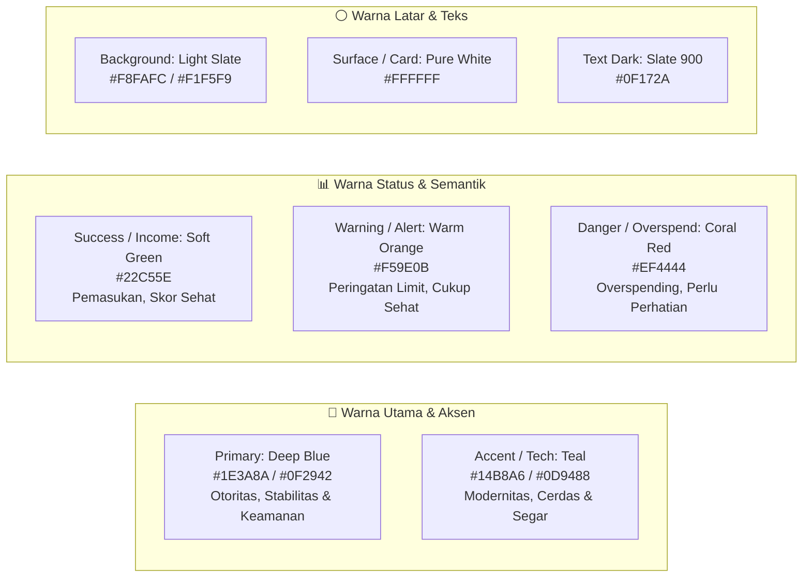
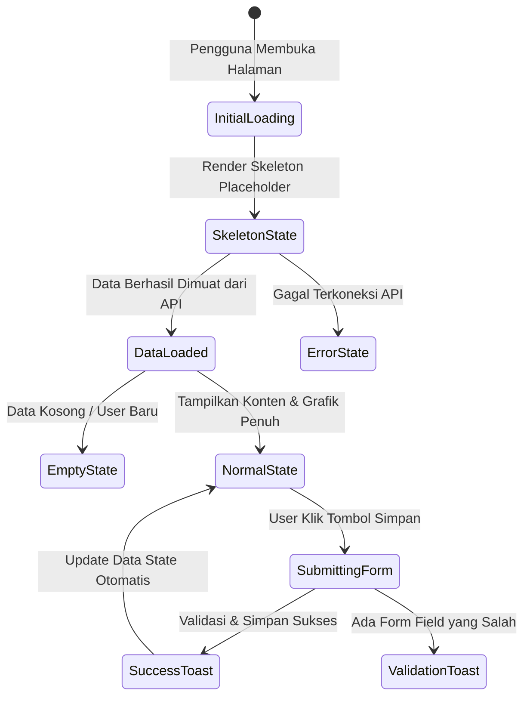

# Spesifikasi Desain & Panduan UI/UX
# SADAR Finance — Smart AI-Driven Personal Finance Platform

| Versi Dokumen | Status | Terakhir Diperbarui | Target Platform |
|---|---|---|---|
| **v1.0.0** | **Approved** | **Agustus 2026** | **Web Responsive (Desktop, Tablet, Mobile)** |

---

## 1. Filosofi & Prinsip Desain

Desain antarmuka **SADAR Finance** dibangun dengan prinsip utama yang berfokus pada kenyamanan pengguna dalam mengelola keuangan harian:

1. **Clean, Modern & Card-Based**:
   - Seluruh konten dikelompokkan dalam kartu-kartu (*cards*) dengan batas visual yang tegas namun lembut (*soft borders and subtle shadows*).
   - Menghindari kepadatan visual berlebih (*clutter-free*) dengan memanfaatkan ruang kosong (*whitespace/negative space*) yang lega dan proporsional.
2. **AI yang Ramah dan Tidak Bising (*Non-Intrusive AI*)**:
   - Kecerdasan buatan hadir secara fungsional dalam bentuk *insight card*, *smart alert*, *gauge score*, dan pengisian otomatis form hasil scan struk.
   - **Dilarang**: Menggunakan avatar robot futuristik, animasi kilatan cahaya berlebihan, efek cyberpunk, atau jendela chatbot mengambang yang menutupi layar.
3. **Bahasa Antarmuka Bahasa Indonesia Baku & Humanis**:
   - Seluruh teks label, instruksi, notifikasi, dan pesan error menggunakan Bahasa Indonesia yang mudah dipahami, sopan, dan memotivasi pengguna untuk hidup hemat.
4. **Kejelasan Informasi Finansial (*High Scannability*)**:
   - Nominal uang disajikan dengan tipografi yang tegas, pemisah ribuan standar Indonesia (`Rp 1.250.000`), serta pewarnaan semantik (Hijau untuk Pemasukan, Merah/Abu gelap untuk Pengeluaran).

---

## 2. Sistem Warna (*Color System & Design Tokens*)

Palet warna SADAR Finance dirancang untuk memberikan kesan profesional, tepercaya (*trustworthy*), tenang, dan modern khas aplikasi finansial papan atas:



### Tabel Spesifikasi Warna (*Token Matrix*)

| Nama Token | Hex Code | RGB | Contoh Penggunaan |
|---|---|---|---|
| `--color-primary` | `#1E3A8A` | `rgb(30, 58, 138)` | Warna tombol primer, header aktif, logo brand, active menu sidebar |
| `--color-primary-dark` | `#0F2942` | `rgb(15, 41, 66)` | Hover state tombol primer, aksen gelap topbar |
| `--color-accent` | `#14B8A6` | `rgb(20, 184, 166)` | Ikon fitur AI, progress bar aktif, chart line sekunder, badge aktif |
| `--color-accent-light` | `#CCFBF1` | `rgb(204, 251, 241)` | Latar belakang badge insight, highlight card ringan |
| `--color-success` | `#22C55E` | `rgb(34, 197, 94)` | Nominal pemasukan (+), indikator skor finansial 71–100, badge status sukses |
| `--color-warning` | `#F59E0B` | `rgb(245, 158, 11)` | Indikator skor finansial 41–70, alert mendekati limit budget, badge pending |
| `--color-danger` | `#EF4444` | `rgb(239, 68, 68)` | Indikator skor finansial 0–40, peringatan overspending kritis, tombol hapus |
| `--color-bg-main` | `#F8FAFC` | `rgb(248, 250, 252)` | Latar belakang halaman aplikasi utama |
| `--color-card-bg` | `#FFFFFF` | `rgb(255, 255, 255)` | Latar belakang modul kartu, modal, popover, dropdown |
| `--color-text-main` | `#0F172A` | `rgb(15, 23, 42)` | Judul halaman, angka metrik utama, label teks penting |
| `--color-text-muted` | `#64748B` | `rgb(100, 116, 139)` | Subteks, keterangan tanggal, placeholder input, breadcrumb |
| `--color-border` | `#E2E8F0` | `rgb(226, 232, 240)` | Garis batas kartu, pemisah tabel, border input form |

---

## 3. Tipografi (*Typography System*)

Sistem tipografi menggunakan font modern sans-serif **Inter** atau **Outfit** yang sangat mudah dibaca pada layar perangkat digital:

```css
/* Stack Font Utama */
font-family: 'Inter', -apple-system, BlinkMacSystemFont, 'Segoe UI', Roboto, sans-serif;
```

| Tingkatan Teks | Ukuran (Size) | Ketebalan (Weight) | Jarak Baris (Line Height) | Penggunaan |
|---|---|---|---|---|
| **Heading 1 (H1)** | 28px – 32px | Bold (700) | 1.25 | Judul utama halaman (Dashboard, Catat Keuangan) |
| **Heading 2 (H2)** | 20px – 24px | Semi-Bold (600) | 1.3 | Judul kartu section, nama grafik, sub-header |
| **Heading 3 (H3)** | 16px – 18px | Semi-Bold (600) | 1.4 | Judul sub-seksi, judul modal dialog |
| **Metric Large** | 24px – 28px | Bold (700) | 1.2 | Angka nominal pada summary cards (Total Saldo, Pemasukan) |
| **Body Text** | 14px – 15px | Regular (400) | 1.5 | Paragraf penjelasan, isi deskripsi transaksi |
| **Body Medium** | 14px – 15px | Medium (500) | 1.5 | Label input form, baris data tabel, item menu |
| **Caption / Small** | 12px – 13px | Regular / Medium | 1.4 | Keterangan tanggal, badge pill, status subtext |

---

## 4. Struktur Tata Letak Global (*Global Layout Architecture*)

Antarmuka web SADAR Finance menerapkan struktur **3-Wilayah Konsisten**:

```
+-----------------------------------------------------------------------------------+
|  SIDEBAR (Kiri)  |  TOPBAR HEADER (Atas)                                          |
|  - Logo Brand    |  - Search Bar  |  Notification Bell (Alerts)  | Profile Dropdown |
|  - 5 Menu Utama  +----------------------------------------------------------------+
|  1. Dashboard    |  MAIN CONTENT AREA (Tengah - Bawah)                            |
|  2. Catat        |                                                                |
|  3. Insight      |  [ Breadcrumb & Judul Halaman ]                                |
|  4. Score        |  [ Dynamic Content Sections / Grid Cards ]                     |
|  5. Profile      |                                                                |
+------------------+----------------------------------------------------------------+
```

### 4.1 Navigasi Sidebar (5 Menu Utama Eksklusif)

Sidebar vertikal di sisi kiri layar memiliki lebar tetap (250px pada Desktop, collapsible pada Tablet/Mobile):

| No | Nama Menu | Ikon Feather / Lucide | Route | Keterangan |
|---|---|---|---|---|
| 1 | **Dashboard** | `grid` / `home` | `/dashboard` | Ringkasan finansial, saldo gabungan, grafik, dan aksi cepat. |
| 2 | **Catat Keuangan** | `wallet` / `receipt` | `/catat-keuangan` | Form transaksi pengeluaran (manual + scan struk) & pemasukan. |
| 3 | **Behavior Insight** | `trending-up` / `pie-chart` | `/behavior-insight` | Analitik pola pengeluaran, Weekend vs Weekday, & rekomendasi. |
| 4 | **Financial Score** | `activity` / `gauge` | `/financial-score` | Skor kesehatan finansial 0–100, status, dan 4 faktor penilaian. |
| 5 | **Profil & Akun** | `user` / `settings` | `/profile-account` | Data profil, kelola multi-akun (Bank/E-wallet), budget, riwayat. |

> ⚠️ **Aturan Navigasi Penting**: Opsi **Keluar (*Logout*)** dilarang diletakkan sebagai menu di sidebar. Logout ditempatkan secara elegan di dalam **Profile Dropdown Topbar**.

### 4.2 Topbar Header
- **Pencarian Cepat (*Global Search*)**: Input untuk mencari transaksi atau kategori secara cepat.
- **Lonceng Notifikasi (*Alerts Bell*)**: Menampilkan badge merah/kuning jika terdapat notifikasi potensi overspending atau batas budget.
- **Profile Avatar Dropdown**:
  - Foto avatar pengguna & Nama lengkap.
  - Alamat email.
  - Link pintasan: *Pengaturan Profil*, *Kelola Akun*.
  - Pemisah (*Divider*).
  - Tombol **Keluar (*Logout*)** dengan konfirmasi SweetAlert dialog.

---

## 5. Standar Komponen Desain (*Component Standards*)

### 5.1 Kartu Konten (*Card Components*)
- **Border Radius**: `16px` (Desktop) / `12px` (Mobile).
- **Shadow**: `box-shadow: 0 4px 20px -2px rgba(15, 23, 42, 0.06);` (Lembut dan tidak tajam).
- **Border**: `1px solid #E2E8F0`.
- **Padding**: `24px` untuk kartu besar, `16px` untuk kartu ringkas.
- **Hover Effect**: Transisi elevasi halus `transform: translateY(-2px); box-shadow: 0 10px 25px -4px rgba(15, 23, 42, 0.1);`.

### 5.2 Formulir & Input (*Form Elements*)
- **Input Fields**: Tinggi `44px`, sudut rounded `10px`, border halus `#CBD5E1`.
- **Focus State**: Outline teal lembut `box-shadow: 0 0 0 3px rgba(20, 184, 166, 0.2); border-color: #14B8A6;`.
- **Label Form**: Teks berbobot Medium (`font-weight: 500`), warna `#334155`, disertai tanda bintang merah untuk field wajib.
- **Mata Uang (Prefix)**: Prefix statis `Rp` di sisi kiri input dengan pemisah ribuan otomatis (*autonumeric formatting*).

### 5.3 Dropzone Scan Struk (*OCR Upload Component*)
- **Tampilan**: Area kotak putus-putus (*dashed border*) berwarna `#94A3B8` dengan latar belakang `#F8FAFC`.
- **Ikon & Petunjuk**: Ikon kamera/dokumen di tengah, teks panduan *"Tarik & lepas foto struk di sini atau klik untuk memilih file"*.
- **Pratinjau Gambar**: Menampilkan thumbnail struk dengan tombol ganti/hapus file.
- **Status Pemrosesan**: Menampilkan animasi progress bar halus dengan status *"Memindai data struk..."*.

---

## 6. Spesifikasi Tata Letak Halaman (*Screen Layouts*)

### 6.1 Halaman Dashboard (`/dashboard`)
```
+-----------------------------------------------------------------------------------+
|  [ Sapaan Personal: "Halo, Aqyla! Yuk cek kondisi keuanganmu hari ini." ]         |
+-----------------------------------------------------------------------------------+
|  [ Total Saldo ]  |  [ Pemasukan ]  |  [ Pengeluaran ]  | [ Sisa Budget ] | [ Jml Trx ] |
|  Rp 2.500.000     |  Rp 4.000.000   |  Rp 1.500.000     | Rp 800.000      | 128 Trx     |
+-----------------------------------------------------------------------------------+
|  [ Grafik Arus Kas: Income vs Expense ]       |  [ Donut: Distribusi Kategori ]   |
|  (ApexCharts Bar / Area Bulanan)              |  (Needs 50%, Wants 30%, Sav 20%)  |
+-----------------------------------------------------------------------------------+
|  [ Smart Insight Card (AI) ]                  |  [ Smart Alert Card (Peringatan) ]|
|  "Pengeluaran makan meningkat 12% pekan ini"  |  "Budget Makan sudah terpakai 82%"|
+-----------------------------------------------------------------------------------+
|  [ Tabel Transaksi Terbaru (5-10 baris) ]     |  [ Tombol Pintasan Cepat ]        |
|  Merchant | Kategori | Akun | Nominal | Tgl   |  [+ Pengeluaran] [+ Pemasukan]    |
+-----------------------------------------------------------------------------------+
```

### 6.2 Halaman Catat Keuangan (`/catat-keuangan`)
- **Navigasi Tab Bagian Atas**: `[ Tab 1: Transaksi Pengeluaran ]` | `[ Tab 2: Pemasukan / Income ]`.
- **Tampilan Tab Transaksi**:
  - Pilihan radio mode: `(o) Input Manual`  `( ) Scan Struk Belanja (OCR)`.
  - Jika Scan Struk dipilih: Dropzone upload gambar muncul di sisi kiri, form isian otomatis muncul di sisi kanan.
  - Form Fields: Pilih Akun (Dropdown), Nominal (Rp), Kategori Utama (Needs/Wants/Savings), Kategori Detail (Makanan, Transport, dll.), Tanggal & Jam, Catatan Merchant.
- **Tampilan Tab Income**:
  - Form ringkas: Akun Penerima, Jumlah Pemasukan (Rp), Sumber Dana (Gaji, Bonus, dll.), Tanggal, Catatan.

### 6.3 Halaman Behavior Insight (`/behavior-insight`)
- Bersifat **Read-Only / Murni Visualisasi**:
  1. **Header Tren Finansial**: Banner status tren (*Frugal / Balanced / Moderate / Overspending*) dengan saran praktis.
  2. **Grafik Weekend vs Weekday**: Bar chart perbandingan rata-rata pengeluaran hari kerja vs akhir pekan.
  3. **Top 5 Kategori Dominan**: Bar horizontal yang memperlihatkan alokasi pengeluaran terbesar.
  4. **Kartu Deteksi Anomali / Spike**: Penjelasan transaksi yang melonjak signifikan beserta mitigasinya.

### 6.4 Halaman Financial Score (`/financial-score`)
- **Visual Utama**: Radial Gauge / Speedometer Chart besar dengan skor 0–100 di tengah.
- **Pill Status**: Badge status dengan warna dinamis (🟢 Sehat, 🟡 Cukup Sehat, 🔴 Perlu Perhatian).
- **Grid 4 Pilar Penilaian**:
  - Kartu Rasio Tabungan (Bobot 35%).
  - Kartu Kontrol Pengeluaran (Bobot 30%).
  - Kartu Disiplin Anggaran (Bobot 20%).
  - Kartu Konsistensi Pencatatan (Bobot 15%).
- **Daftar Rekomendasi Peningkatan Skor**: Langkah konkret yang dapat dilakukan pengguna untuk menaikkan skor.

### 6.5 Halaman Profil & Akun (`/profile-account`)
- **Section 1 (Data Profil)**: Form data identitas, foto profil, dan tombol ubah password.
- **Section 2 (Kelola Multi-Akun)**: Grid kartu akun (Cash, BCA, GoPay) dengan tombol Tambah Akun Baru (Modal Dialog), Edit, dan Hapus.
- **Section 3 (Atur Budget)**: Pengaturan batas anggaran per pos 50/30/20 dan batas per kategori.
- **Section 4 (Riwayat Transaksi)**: Tabel riwayat view-only lengkap dengan filter tanggal, pencarian, dan tombol ekspor CSV/Excel.

---

## 7. Panduan State & Interaksi (*Interaction & State Guidelines*)



1. **Skeleton Loaders (Loading State)**:
   - Dilarang menampilkan layar putih kosong saat mengambil data. Gunakan animasi skeleton berkilau (*shimmer animation*) dengan bentuk menyerupai kartu asli.
2. **Empty States (Kondisi Kosong)**:
   - Jika pengguna baru belum memiliki transaksi, tampilkan ilustrasi minimalis dan teks ramah: *"Belum ada transaksi tercatat. Mulai catat pengeluaran atau scan struk pertamamu!"* disertai tombol aksi langsung.
3. **Umpan Balik Notifikasi (*Toast Feedback*)**:
   - Transaksi berhasil disimpan: Toast hijau di pojok kanan atas (*"Transaksi berhasil disimpan!"*).
   - Validasi gagal: Pesan error merah tepat di bawah input field terkait.
4. **Dialog Konfirmasi (*Confirmation Modals*)**:
   - Aksi destruktif (menghapus akun dompet, membatalkan transaksi) wajib memunculkan modal konfirmasi dengan dua tombol: *Batal (Abu-abu)* dan *Ya, Hapus (Merah)*.
