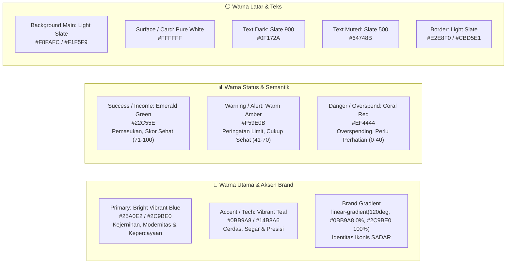

# Spesifikasi Desain & Panduan UI/UX
# SADAR Finance — Smart AI-Driven Personal Finance Platform

| Versi Dokumen | Status | Terakhir Diperbarui | Target Platform |
|---|---|---|---|
| **v1.1.0** | **Approved** | **Agustus 2026** | **Web Responsive (Desktop, Tablet, Mobile)** |

---

## 1. Filosofi & Prinsip Desain

Desain antarmuka **SADAR Finance** dibangun dengan prinsip utama yang berfokus pada kenyamanan, kejernihan, dan kemudahan pengguna dalam mengelola keuangan harian:

1. **Clean, Modern & Vibrant Card-Based**:
   - Seluruh konten dikelompokkan dalam kartu-kartu (*cards*) dengan batas visual yang tegas namun lembut (*soft borders and subtle shadows*).
   - Tampilan mengusung nuansa **terang, segar, dan bersih (*light & airy*)**, memanfaatkan ruang kosong (*whitespace/negative space*) yang lega dan proporsional.
2. **Identitas Biru Cerah & Toska Dinamis (*Bright & Uplifting Visuals*)**:
   - Menghindari kesan gelap, suram, kaku, atau monokromatik gelap (*no gloomy dark navies*).
   - Warna utama adalah **Biru Cerah (*Bright Vibrant Sky Blue / Cyan*)** yang dipadukan dengan aksen **Toska Segar (*Teal*)** untuk memancarkan optimisme dan kesadaran finansial yang positif.
3. **AI yang Ramah dan Tidak Bising (*Non-Intrusive AI*)**:
   - Kecerdasan buatan hadir secara fungsional dalam bentuk *insight card*, *smart alert*, *gauge score*, dan pengisian otomatis form hasil scan struk.
   - **Dilarang**: Menggunakan avatar robot futuristik berlebihan, efek cyberpunk gelap, atau jendela chatbot mengambang yang menutupi layar.
4. **Bahasa Antarmuka Bahasa Indonesia Baku & Humanis**:
   - Seluruh teks label, instruksi, notifikasi, dan pesan error menggunakan Bahasa Indonesia yang mudah dipahami, sopan, dan memotivasi pengguna untuk hidup hemat dan mindful.
5. **Kejelasan Informasi Finansial (*High Scannability*)**:
   - Nominal uang disajikan dengan tipografi yang tegas, pemisah ribuan standar Indonesia (`Rp 1.250.000`), serta pewarnaan semantik (Hijau untuk Pemasukan, Merah/Abu gelap untuk Pengeluaran).

---

## 2. Sistem Warna (*Color System & Design Tokens*)

Palet warna SADAR Finance dirancang untuk memberikan kesan cerah, modern, tepercaya (*trustworthy*), dan energik:



### Tabel Spesifikasi Warna (*Token Matrix*)

| Nama Token | Hex Code | RGB | Contoh Penggunaan |
|---|---|---|---|
| `--color-primary` | `#25A0E2` | `rgb(37, 160, 226)` | Warna utama brand, tautan aktif, aksen grafis utama |
| `--color-primary-dark` | `#1A85BE` | `rgb(26, 133, 190)` | Hover state tombol primer, active state |
| `--color-primary-light` | `#E0F2FE` | `rgb(224, 242, 254)` | Background badge primer, highlight card ringan |
| `--color-accent` | `#0BB9A8` | `rgb(11, 185, 168)` | Ikon fitur AI, progress bar aktif, chart line sekunder, badge aktif |
| `--color-accent-light` | `#CCFBF1` | `rgb(204, 251, 241)` | Latar belakang badge insight, highlight card ringan |
| `--color-brand-gradient` | `#0BB9A8` → `#2C9BE0` | `linear-gradient(...)` | Tombol CTA utama (Auth style), hero gradient, brand card accent |
| `--color-success` | `#22C55E` | `rgb(34, 197, 94)` | Nominal pemasukan (+), indikator skor finansial 71–100, badge status sukses |
| `--color-warning` | `#F59E0B` | `rgb(245, 158, 11)` | Indikator skor finansial 41–70, alert mendekati limit budget, badge pending |
| `--color-danger` | `#EF4444` | `rgb(239, 68, 68)` | Indikator skor finansial 0–40, peringatan overspending kritis, tombol hapus |
| `--color-bg-main` | `#F8FAFC` | `rgb(248, 250, 252)` | Latar belakang halaman aplikasi utama |
| `--color-card-bg` | `#FFFFFF` | `rgb(255, 255, 255)` | Latar belakang modul kartu, modal, popover, dropdown |
| `--color-text-main` | `#0F172A` | `rgb(15, 23, 42)` | Judul halaman, angka metrik utama, label teks penting |
| `--color-text-muted` | `#64748B` | `rgb(100, 116, 139)` | Subteks, keterangan tanggal, placeholder input, breadcrumb |
| `--color-border` | `#E2E8F0` | `rgb(226, 232, 240)` | Garis batas kartu, pemisah tabel, border input form |

---

## 3. Tipografi (*Typography System*)

Sistem tipografi menggunakan font modern sans-serif **Inter** atau **Outfit** yang bersih, mudah dibaca, dan proporsional:

```css
/* Stack Font Utama */
font-family: 'Inter', -apple-system, BlinkMacSystemFont, 'Segoe UI', Roboto, sans-serif;
```

| Tingkatan Teks | Ukuran (Size) | Ketebalan (Weight) | Jarak Baris (Line Height) | Penggunaan |
|---|---|---|---|---|
| **Heading 1 (H1)** | 28px – 34px | Bold (700) / ExtraBold (800) | 1.2 | Judul utama halaman (Dashboard, Catat Keuangan, Hero Headline) |
| **Heading 2 (H2)** | 20px – 24px | Semi-Bold (600) / Bold (700) | 1.3 | Judul kartu section, nama grafik, sub-header |
| **Heading 3 (H3)** | 16px – 18px | Semi-Bold (600) | 1.4 | Judul sub-seksi, judul modal dialog, fitur card |
| **Metric Large** | 24px – 30px | ExtraBold (800) | 1.2 | Angka nominal summary cards (Total Saldo, Pemasukan) |
| **Body Text** | 14px – 15px | Regular (400) | 1.5 | Paragraf penjelasan, isi deskripsi transaksi |
| **Body Medium** | 14px – 15px | Medium (500) / Semi-Bold (600) | 1.5 | Label input form, baris data tabel, item menu |
| **Caption / Small** | 12px – 13px | Regular / Medium | 1.4 | Keterangan tanggal, badge pill, status subtext |

---

## 4. Standar Komponen Tombol (*Button Standards - Auth Consistent*)

Seluruh tombol di aplikasi (baik di landing page, form autentikasi, maupun dashboard) harus mematuhi standar konsisten berikut:

```
+-----------------------------------------------------------------------------------+
|  1. TOMBOL UTAMA (Primary Button - Auth Style)                                    |
|     - Gradasi: linear-gradient(120deg, #0BB9A8 0%, #2C9BE0 100%)                  |
|     - Teks: Putih (#FFFFFF), font-weight: 600 / 700                                |
|     - Sudut (Radius): 10px - 14px (rounded-xl)                                    |
|     - Shadow: box-shadow: 0 4px 14px 0 rgba(44, 155, 224, 0.3)                   |
|     - Hover: translateY(-1px) & shadow meningkat (rgba(44, 155, 224, 0.45))       |
+-----------------------------------------------------------------------------------+
|  2. TOMBOL SEKUNDER / OUTLINE (Secondary Button)                                 |
|     - Latar: Putih (#FFFFFF) / Transparan Kaca (#FFFFFF dengan opacity 0.85)       |
|     - Border: 1px solid #E2E8F0                                                   |
|     - Teks: Slate 700 (#334155) / Semi-Bold (600)                                 |
|     - Hover: Background #F8FAFC, border #25A0E2, teks #25A0E2                     |
+-----------------------------------------------------------------------------------+
|  3. TOMBOL AKSI DESTRUKTIF / DANGER                                              |
|     - Latar: Coral Red (#EF4444), hover (#DC2626)                                 |
|     - Teks: Putih (#FFFFFF), font-weight: 600                                      |
+-----------------------------------------------------------------------------------+
```

---

## 5. Struktur Tata Letak Global (*Global Layout Architecture*)

Antarmuka web SADAR Finance menerapkan struktur **3-Wilayah Konsisten**:

```
+-----------------------------------------------------------------------------------+
|  SIDEBAR (Kiri)  |  TOPBAR HEADER (Atas)                                          |
|  - Logo Brand    |  - Search Bar  |  Notification Bell (Alerts)  | Profile Dropdown |
|  - 5 Menu Utama  +----------------------------------------------------------------+
|  1. Dashboard    |  MAIN CONTENT AREA (Tengah - Bawah)                            |
|  2. Catat        |                                                                |
|  3. Insight      |  [ Breadcrumb & Judul Halaman ]                                |
|  4. Score        |  [ Dynamic Content Sections / Grid Cards ]                     |
|  5. Profile      |                                                                |
+------------------+----------------------------------------------------------------+
```

### 5.1 Navigasi Sidebar (5 Menu Utama Eksklusif)

Sidebar vertikal di sisi kiri layar memiliki lebar tetap (250px pada Desktop, collapsible pada Tablet/Mobile):

| No | Nama Menu | Ikon Feather / Lucide | Route | Keterangan |
|---|---|---|---|---|
| 1 | **Dashboard** | `grid` / `home` | `/dashboard` | Ringkasan finansial, saldo gabungan, grafik, dan aksi cepat. |
| 2 | **Catat Keuangan** | `wallet` / `receipt` | `/catat-keuangan` | Form transaksi pengeluaran (manual + scan struk) & pemasukan. |
| 3 | **Behavior Insight** | `trending-up` / `pie-chart` | `/behavior-insight` | Analitik pola pengeluaran, Weekend vs Weekday, & rekomendasi. |
| 4 | **Financial Score** | `activity` / `gauge` | `/financial-score` | Skor kesehatan finansial 0–100, status, dan 4 faktor penilaian. |
| 5 | **Profil & Akun** | `user` / `settings` | `/profile-account` | Data profil, kelola multi-akun (Bank/E-wallet), budget, riwayat. |

> ⚠️ **Aturan Navigasi Penting**: Opsi **Keluar (*Logout*)** dilarang diletakkan sebagai menu di sidebar. Logout ditempatkan secara elegan di dalam **Profile Dropdown Topbar**. Route publik otentikasi adalah `/login` dan `/register`.

### 5.2 Topbar Header
- **Pencarian Cepat (*Global Search*)**: Input untuk mencari transaksi atau kategori secara cepat.
- **Lonceng Notifikasi (*Alerts Bell*)**: Menampilkan badge merah/kuning jika terdapat notifikasi potensi overspending atau batas budget.
- **Profile Avatar Dropdown**:
  - Foto avatar pengguna & Nama lengkap.
  - Alamat email.
  - Link pintasan: *Pengaturan Profil*, *Kelola Akun*.
  - Pemisah (*Divider*).
  - Tombol **Keluar (*Logout*)** dengan konfirmasi dialog.

---

## 6. Standar Komponen Desain (*Component Standards*)

### 6.1 Kartu Konten (*Card Components*)
- **Border Radius**: `16px` (Desktop) / `12px` (Mobile).
- **Shadow**: `box-shadow: 0 4px 20px -2px rgba(15, 23, 42, 0.05);` (Lembut dan tidak tajam).
- **Border**: `1px solid #E2E8F0`.
- **Padding**: `24px` untuk kartu besar, `16px` untuk kartu ringkas.
- **Hover Effect**: Transisi elevasi halus `transform: translateY(-2px); box-shadow: 0 10px 25px -4px rgba(37, 160, 226, 0.1);`.

### 6.2 Formulir & Input (*Form Elements*)
- **Input Fields**: Tinggi `44px`, sudut rounded `10px`, border halus `#CBD5E1`.
- **Focus State**: Outline biru cerah/teal lembut `box-shadow: 0 0 0 3px rgba(37, 160, 226, 0.2); border-color: #25A0E2;`.
- **Label Form**: Teks berbobot Medium (`font-weight: 500`), warna `#334155`, disertai tanda bintang merah untuk field wajib.
- **Mata Uang (Prefix)**: Prefix statis `Rp` di sisi kiri input dengan pemisah ribuan otomatis (*autonumeric formatting*).

### 6.3 Dropzone Scan Struk (*OCR Upload Component*)
- **Tampilan**: Area kotak putus-putus (*dashed border*) berwarna `#94A3B8` dengan latar belakang `#F8FAFC`.
- **Ikon & Petunjuk**: Ikon kamera/dokumen di tengah, teks panduan *"Tarik & lepas foto struk di sini atau klik untuk memilih file"*.
- **Pratinjau Gambar**: Menampilkan thumbnail struk dengan tombol ganti/hapus file.
- **Status Pemrosesan**: Menampilkan animasi progress bar halus dengan status *"Memindai data struk..."*.

---

## 7. Spesifikasi Tata Letak Halaman (*Screen Layouts*)

### 7.1 Halaman Landing (`/` atau `/landing`)
- Menggunakan tema **terang, segar, dan berenergi**.
- Header navigasi transparan dengan efek blur kaca halus (*glassmorphism*).
- Hero section dengan headline yang tegas dan tombol CTA primer bergaya gradasi cerah SADAR (`#0BB9A8` → `#2C9BE0`).
- Showcase dashboard interaktif dengan preview bersih tanpa elemen gelap suram.
- Bento grid fitur menampilkan scanner OCR interaktif, financial health score simulator, dan kalkulator budget 50/30/20.

### 7.2 Halaman Dashboard (`/dashboard`)
- Ringkasan metrik saldo gabungan, pemasukan, pengeluaran, dan sisa kuota budget bulanan.
- Visualisasi grafik arus kas bulanan dan donat distribusi kategori 50/30/20.
- Kartu AI Smart Insight & Smart Alert dengan indikator warna semantik.

### 7.3 Halaman Catat Keuangan (`/catat-keuangan`)
- Tab pengeluaran (Manual & Scan Struk OCR) serta tab pemasukan.
- Form responsif dengan kategorisasi otomatis.

### 7.4 Halaman Behavior Insight (`/behavior-insight`)
- Analitik pola belanja mingguan vs akhir pekan, perbandingan pos, dan rekomendasi hemat cerdas.

### 7.5 Halaman Financial Score (`/financial-score`)
- Speedometer gauge 0–100 dengan indikator dinamis 🟢 Sehat, 🟡 Cukup Sehat, 🔴 Perlu Perhatian beserta 4 pilar evaluasi.

### 7.6 Halaman Profil & Akun (`/profile-account`)
- Manajemen akun multi-dompet (Tunai, Bank, E-Wallet), batas alokasi anggaran, dan riwayat transaksi.

---

## 8. Panduan State & Interaksi (*Interaction & State Guidelines*)

1. **Skeleton Loaders (Loading State)**:
   - Menggunakan animasi shimmer berkilau yang halus berbentuk kartu placeholder.
2. **Empty States (Kondisi Kosong)**:
   - Tampilan bersih dengan ilustrasi minimalis dan teks ramah mengajak pengguna mencatat transaksi pertama.
3. **Umpan Balik Notifikasi (*Toast Feedback*)**:
   - Notifikasi sukses dengan toast hijau bersih, pesan validasi merah jelas di bawah field input.
4. **Dialog Konfirmasi (*Confirmation Modals*)**:
   - Modal konfirmasi jelas untuk aksi sensitif (hapus dompet/transaksi) dengan tombol Batal dan Hapus.
