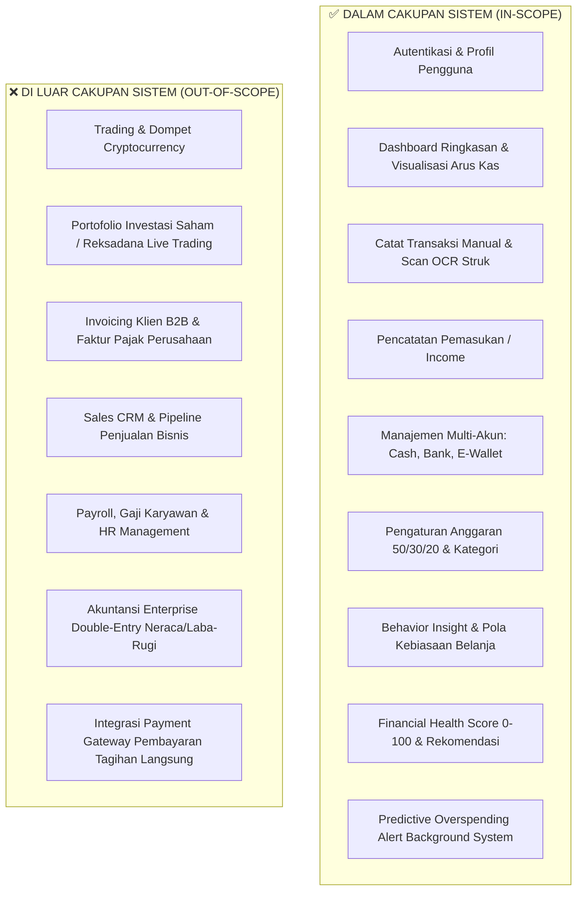
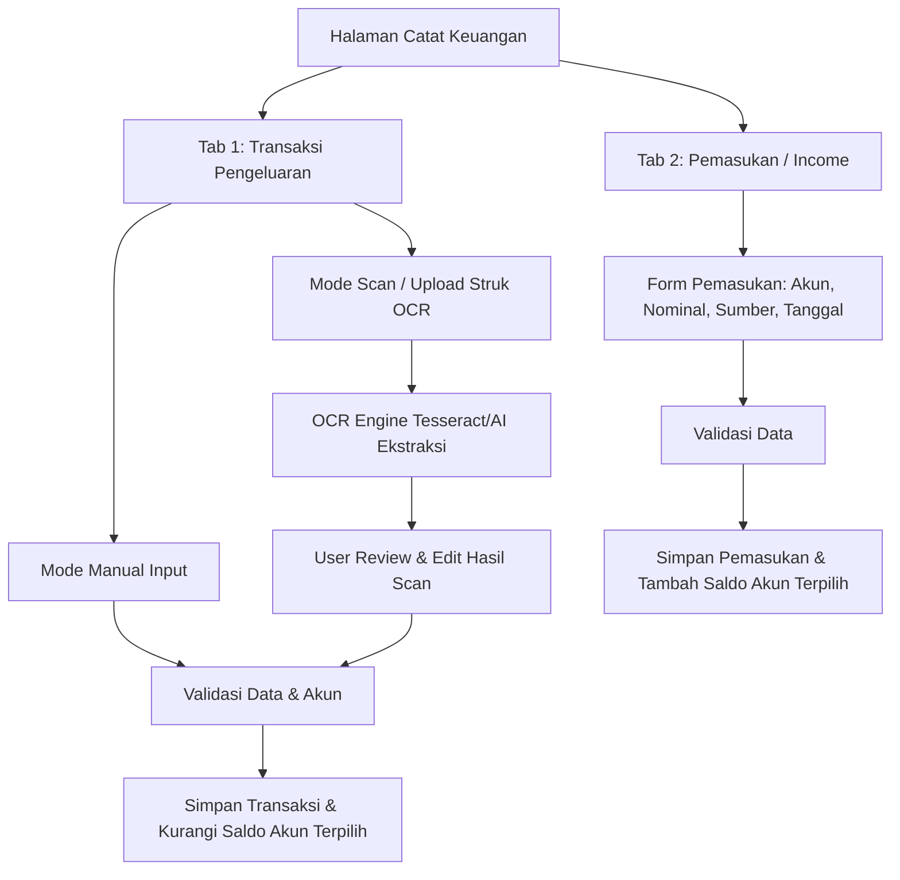

# Product Requirements Document (PRD)
# SADAR Finance — Smart AI-Driven Personal Finance Platform

| Versi Dokumen | Status | Terakhir Diperbarui | Penulis / Pemilik |
|---|---|---|---|
| **v1.0.0 (Production-Ready)** | **Approved / Active** | **Agustus 2026** | **Tim SADAR Finance & Product Engineering** |

---

## 1. Ringkasan Eksekutif & Visi Produk

### 1.1 Visi Produk
**SADAR Finance** adalah platform manajemen keuangan pribadi (*personal finance web application*) yang dirancang untuk membangun **kesadaran finansial (*mindful spending*)** pengguna melalui pencatatan transaksi yang mudah, analisis perilaku belanja berbasis AI (*behavior analytics*), penilaian kesehatan finansial objektif (*Financial Health Score*), serta deteksi dini risiko keborosan (*predictive overspending alert*).

> **Pernyataan Misi:** *"Membantu setiap individu memahami ke mana uang mereka mengalir, mengontrol kebiasaan finansial tanpa beban pencatatan manual yang rumit, dan mengambil keputusan keuangan yang lebih cerdas dan terukur."*

### 1.2 Target Masalah Pengguna (*Problem Statement*)
1. **Lupa dan Malas Mencatat Keuangan**: Pengguna sering menunda atau berhenti mencatat transaksi karena proses input manual dari struk belanja fisik atau invoice e-commerce yang membosankan.
2. **Ketidaksadaran Pengeluaran Mikro (*Latte Factor*)**: Pengeluaran-pengeluaran kecil impulsif (kopi, jajan, subscription) terakumulasi tanpa disadari hingga budget habis di pertengahan bulan.
3. **Ketiadaan Tolok Ukur Kesehatan Finansial**: Banyak individu tidak mengetahui apakah kondisi keuangannya saat ini tergolong sehat, cukup sehat, atau berbahaya.
4. **Pendekatan AI yang Terlalu Bising / Rumit**: Banyak aplikasi fintech yang membebani antarmuka dengan chatbot besar, visual robot, atau istilah teknis yang justru membingungkan pengguna awam.

### 1.3 Solusi Nilai (*Value Proposition*)
- **Pencatatan Cepat & OCR Struk Otomatis**: Pengguna dapat mencatat manual dalam hitungan detik atau mengunggah foto struk belanja yang langsung diekstraksi nominal, merchant, dan kategorinya secara otomatis.
- **AI yang Bersih dan Tidak Mengganggu (*Non-Intrusive AI*)**: Kecerdasan buatan bekerja di latar belakang menghasilkan *insight* perilaku, peringatan dini, dan skor numerik yang langsung dapat ditindaklanjuti tanpa *chatbot clutter*.
- **Metrik Kesehatan Finansial yang Transparan**: Skor 0–100 dengan indikator warna yang jelas berbasis rasio tabungan, kontrol pengeluaran, disiplin anggaran, dan konsistensi pencatatan.
- **Deteksi Overspending Proaktif**: Peringatan otomatis ketika laju pengeluaran diproyeksikan melebihi budget bulanan.

---

## 2. Cakupan Sistem (*System Scope*)

Untuk menjaga fokus produk pada ranah **Personal Finance**, batasan ruang lingkup didefinisikan secara tegas:

---

## 3. Persona Pengguna (*User Personas*)

### Persona 1: Rian (First-jobber / Karyawan Muda)
- **Profil**: 23 tahun, gaji bulanan tetap, pengguna aktif e-wallet dan QRIS.
- **Kebutuhan**: Ingin tahu kenapa uangnya selalu habis sebelum tanggal 20, butuh visualisasi simpel kategori pengeluaran dan peringatan dini saat jajan berlebihan.
- **Pain Point**: Malas mencatat setiap jajan kopi satu per satu; butuh scan struk belanja cepat.

### Persona 2: Maya (Freelancer / Kreator Konten)
- **Profil**: 28 tahun, pendapatan bervariasi dengan tanggal penerimaan tidak tetap, memiliki beberapa rekening bank dan dompet digital.
- **Kebutuhan**: Memantau beberapa akun (*multi-account*), mengatur alokasi budget fleksibel, dan mengetahui skor kesehatan keuangan secara berkala.
- **Pain Point**: Kesulitan mengukur apakah gaya hidupnya seimbang dengan pendapatannya yang fluktuatif.

---

## 4. Spesifikasi Fitur Fungsional (*Functional Specifications*)

### 4.1 Modul 1: Autentikasi & Keamanan Pengguna

| ID Fitur | Nama Fitur | Deskripsi | Input / Output |
|---|---|---|---|
| **REQ-AUTH-01** | Pendaftaran Akun (*Register*) | Mendaftarkan pengguna baru dengan validasi data lengkap. | **Input**: Nama Depan, Nama Belakang, Email, Password, Konfirmasi Password, No HP (opsional). **Output**: Akun terdaftar, default multi-account dibuat (Cash/Dompet Utama), token JWT. |
| **REQ-AUTH-02** | Masuk (*Login*) | Autentikasi pengguna menggunakan email dan password terenkripsi. | **Input**: Email & Password. **Output**: Access Token JWT, data user profile, auto-redirect ke `/dashboard`. |
| **REQ-AUTH-03** | Lupa Password | Alur pemulihan kata sandi melalui instruksi reset ke email terdaftar. | **Input**: Email terdaftar. **Output**: Status instruksi reset / verifikasi. |
| **REQ-AUTH-04** | Keluar (*Logout*) | Mengakhiri sesi aktif pengguna, menghapus token di storage lokal/cookie, dan me-redirect ke login. | Terletak di **Profile Dropdown Topbar** (bukan menu utama sidebar). |

---

### 4.2 Modul 2: Dashboard Finansial Utama (`/dashboard`)

Halaman utama yang menyajikan ringkasan holistik kondisi finansial secara *real-time*:

1. **Sapaan Personal (*Greeting Section*)**:
   - Menampilkan sapaan dinamis berdasarkan nama user dan waktu (contoh: *"Halo, Aqyla! Yuk lihat kondisi keuanganmu hari ini."*).
2. **5 Summary Metric Cards**:
   - **Total Saldo Gabungan**: Akumulasi saldo aktif seluruh akun (Cash, Bank, E-Wallet).
   - **Pemasukan Bulan Ini**: Total pemasukan pada bulan kalender berjalan.
   - **Pengeluaran Bulan Ini**: Total transaksi pengeluaran pada bulan kalender berjalan.
   - **Sisa Budget**: Selisih antara batas limit anggaran dengan pengeluaran aktual.
   - **Jumlah Transaksi**: Frekuensi pencatatan transaksi pada periode berjalan.
3. **Cashflow Chart (ApexCharts Bar / Area)**:
   - Komparasi bulanan antara *Total Income vs Total Expense*.
4. **Expense Trend Chart (ApexCharts Line)**:
   - Tren laju pengeluaran harian/mingguan untuk memantau lonjakan pengeluaran.
5. **Spending Category Distribution (Donut Chart)**:
   - Proporsi pengeluaran berdasarkan kategori kebutuhan (*Needs, Wants, Savings/Investment, Other* atau detail sub-kategori).
6. **Smart Insight Cards**:
   - Kartu ringkas berisi 1–3 *insight* utama hasil analisis kebiasaan belanja terbaru.
7. **Smart Alert Banner**:
   - Banner status risiko finansial (contoh: peringatan mendekati limit budget atau lonjakan di kategori tertentu).
8. **Recent Transactions Preview**:
   - Tabel 5–10 transaksi pengeluaran/pemasukan terakhir dengan kolom: *Nama Transaksi, Kategori, Akun, Tanggal, Nominal, Status*.
9. **Quick Action Buttons**:
   - Tombol pintasan cepat ke: *Catat Pengeluaran*, *Tambah Income*, *Lihat Insight*, *Lihat Skor Finansial*.

---

### 4.3 Modul 3: Catat Keuangan (`/catat-keuangan`)

Modul inti untuk pencatatan mutasi keuangan yang dibagi menjadi dua tab terpisah:

#### Tab 1: Transaksi Pengeluaran
- **Pilihan Metode Input**: Radio/Tab *Manual Input* atau *Scan Struk Belanja*.
- **Field Data**:
  - `account_id`: Dropdown pemilihan akun sumber dana (Cash, BCA, GoPay, Mandiri, dll.).
  - `amount`: Nominal transaksi dalam Rupiah (wajib > 0).
  - `category_group` & `category_detail`: Pengelompokan makro (*Needs, Wants, Savings, Other*) dan sub-kategori (*Makanan & Minuman, Transportasi, Belanja, Tagihan, dll.*).
  - `transaction_date`: Tanggal dan jam transaksi.
  - `description` / `source`: Keterangan merchant atau nama pengeluaran (contoh: *"Kopi Tuku Grand Indonesia"*).
  - `receipt_image`: Upload foto struk (opsional jika manual, wajib jika scan struk).
- **Alur Kerja Scan Struk (AI OCR)**:
  1. Pengguna mengunggah gambar struk belanja (JPEG, PNG, WebP hingga 5MB).
  2. Sistem backend mengekstrak teks gambar menggunakan OCR engine.
  3. NLP parser menganalisis total nominal, nama merchant, tanggal struk, dan memprediksi kategori.
  4. Form otomatis terisi dengan data hasil parsing.
  5. Pengguna dapat mengedit/mengoreksi data sebelum menekan tombol simpan.
  6. Setelah disimpan, transaksi tercatat dan saldo akun berkurang secara otomatis.

#### Tab 2: Pemasukan (*Income*)
- **Field Data**:
  - `account_id`: Dropdown akun penerima dana.
  - `amount`: Nominal pemasukan dalam Rupiah.
  - `source`: Sumber pemasukan (*Gaji Bulanan, Freelance, Bonus, Investasi, Transfer Masuk, dll.*).
  - `income_date`: Tanggal pemasukan.
  - `description`: Catatan opsional.
- **Catatan Desain**: Tab Income tidak memerlukan scanner OCR atau pemrosesan AI struk.

---

### 4.4 Modul 4: Behavior Insight (`/behavior-insight`)

Halaman analitik perilaku keuangan pengguna yang bersifat **Read-Only / Murni Analisis** (tanpa formulir input data):

- **Karakteristik & Konten**:
  1. **Executive Insight Summary**: Ringkasan naratif mengenai tren gaya hidup keuangan pengguna (apakah tergolong *Frugal, Balanced, Moderate,* atau *Overspending*).
  2. **Rasio Weekend vs Weekday**: Perbandingan intensitas pengeluaran pada hari kerja (Senin–Jumat) dibandingkan akhir pekan (Sabtu–Minggu).
  3. **Top Dominant Categories**: Analisis 5 kategori pengeluaran terbesar beserta persentase terhadap total pengeluaran.
  4. **Analisis Anomali Pengeluaran (*Spike Detection*)**: Identifikasi transaksi tunggal yang nilainya melonjak secara tidak wajar dibanding rata-rata pengeluaran 7 hari terakhir.
  5. **Rekomendasi Tindakan Finansial Cerdas**: Tips praktis dan terukur untuk menekan pos pengeluaran yang tidak esensial.

---

### 4.5 Modul 5: Skor Kesehatan Keuangan (`/financial-score`)

Modul evaluasi objektif kondisi finansial pengguna berbasis algoritma matematis dan standar perencanaan keuangan:

#### Indikator Status Skor

| Rentang Skor | Status Label | Warna Indikator | Makna & Rekomendasi |
|---|---|---|---|
| **0 – 40** | **Perlu Perhatian** | 🔴 Merah / Coral | Pengeluaran melebihi pemasukan atau tabungan nihil. Perlu pemangkasan biaya *wants* segera. |
| **41 – 70** | **Cukup Sehat** | 🟡 Kuning / Orange | Keuangan stabil namun ruang tabungan/investasi masih terbatas (<20%). |
| **71 – 100** | **Sehat** | 🟢 Hijau Emerald | Rasio tabungan ideal (≥20%), pengeluaran terkendali di bawah limit budget, pencatatan konsisten. |

#### Pembobotan Faktor Skor (*Scoring Breakdown*)
1. **Savings Rate Score (Bobot 35%)**:
   - Dihitung dari `(Total Income - Total Expense) / Total Income`.
   - Nilai 100 jika rasio tabungan ≥ 20%.
2. **Expense Control Score (Bobot 30%)**:
   - Dihitung dari rasio `Total Expense / Total Income`.
   - Nilai 100 jika rasio pengeluaran ≤ 70%.
3. **Budget Discipline Score (Bobot 20%)**:
   - Dihitung dari kepatuhan terhadap limit budget `Total Expense / Budget Limit`.
   - Nilai 100 jika penggunaan budget ≤ 80%.
4. **Recording Consistency Score (Bobot 15%)**:
   - Konsistensi frekuensi pencatatan transaksi selama rentang periode analisis.

---

### 4.6 Modul 6: Profil & Kelola Akun (`/profile-account` & `/profile-edit`)

Modul untuk pengaturan data pribadi, multi-akun dompet, dan target anggaran:

1. **Section 1: Data Profil Pengguna**:
   - Foto profil, Nama Depan, Nama Belakang, Email, Nomor Telepon, Pekerjaan, Alamat, Ubah Password.
2. **Section 2: Kelola Multi-Akun (*Accounts*)**:
   - Menambah, mengubah nama/saldo, dan menghapus akun keuangan.
   - Tipe Akun: *Cash / Dompet Fisik, Rekening Bank (BCA, Mandiri, BRI, BNI, dll.), E-Wallet (GoPay, OVO, Dana, ShopeePay).*
3. **Section 3: Atur Anggaran (*Budget Allocation*)**:
   - Alokasi metode 50/30/20:
     - **Needs (50%)**: Kebutuhan pokok, makan, tempat tinggal, tagihan listrik/air.
     - **Wants (30%)**: Hiburan, belanja sekunder, hobi, rekreasi.
     - **Savings & Investment (20%)**: Tabungan masa depan, dana darurat, investasi.
   - Pengaturan batas limit nominal per kategori pengeluaran.
4. **Section 4: Riwayat Transaksi Lengkap (*History*)**:
   - Tampilan tabel komprehensif seluruh mutasi keuangan dengan fitur filter tanggal, kategori, dan pencarian kata kunci.
   - Bersifat *View-Only* dengan opsi ekspor data.

---

### 4.7 Modul 7: Predictive Spending Alert (*Background Process*)

Proses latar belakang di backend yang mengevaluasi pola belanja pengguna secara berkala tanpa memerlukan interaksi pengguna:

- **Alur Kerja**:
  1. Backend scheduler/evaluator mengambil data transaksi 3 bulan terakhir dan budget aktif pengguna.
  2. Algoritma memproyeksikan estimasi total pengeluaran hingga akhir bulan kalender.
  3. Jika proyeksi pengeluaran melebihi budget limit (rasio > 1.1 atau 1.3), sistem otomatis membuat entri `Alert` baru dengan tipe `overspending` atau `budget_exceeded`.
  4. Alert langsung muncul pada lonceng notifikasi Topbar dan Banner Alert di Dashboard.

---

## 5. Aturan Bisnis & Logika Kalkulasi (*Business Rules*)

1. **Integritas Saldo Akun (*Balance Consistency*)**:
   - Transaksi pengeluaran baru otomatis mengurangi saldo `balance` pada akun yang dipilih.
   - Transaksi pemasukan baru otomatis menambah saldo `balance` pada akun yang dipilih.
   - Penghapusan atau pembatalan transaksi mengembalikan saldo akun ke kondisi semula (*rollback*).
2. **Penolakan Nominal Negatif**:
   - Nominal pada transaksi dan pemasukan wajib berupa angka positif numerik (`amount > 0`).
3. **Isolasi Data Pengguna (*Data Multi-Tenancy*)**:
   - Seluruh kueri basis data wajib menyertakan filter `WHERE user_id = :authenticated_user_id` untuk menjamin keamanan dan privasi data antar pengguna.
4. **Resiliensi AI (*Graceful Degradation*)**:
   - Jika microservice AI Python tidak merespons (*timeout / service down*), backend Node.js wajib otomatis menggunakan algoritma *rule-based fallback* berbasis regex & rata-rata bergerak sehingga pengguna tetap menerima hasil analisis tanpa error 500.

---

## 6. Kebutuhan Non-Fungsional (*Non-Functional Requirements*)

| Parameter | Spesifikasi & Target Standar |
|---|---|
| **Performa & Kecepatan** | - Waktu muat halaman pertama (*First Contentful Paint*) < 1.5 detik. - Respons API standar (CRUD) < 200 ms. - Waktu proses ekstraksi OCR struk < 3.5 detik. |
| **Keamanan Data** | - Enkripsi password menggunakan `bcrypt` dengan cost factor 10. - Autentikasi stateless menggunakan JWT token dengan masa kedaluwarsa. - Proteksi header HTTP menggunakan Helmet. - Sanitasi input terhadap SQL Injection & XSS. - Rate limiting pada endpoint sensitif (Auth & OCR). |
| **Ketersediaan (*Availability*)** | - Target *uptime* sistem 99.5%. - Arsitektur microservice decoupling (jika AI service offline, API utama tetap melayani transaksi). |
| **Kompatibilitas & Responsivitas** | - Berfungsi optimal pada browser modern (Chrome, Edge, Safari, Firefox). - Tampilan responsif untuk Desktop (1920x1080, 1366x768), Tablet (768px), dan Mobile (375px+). |
| **Lokalisasi & Standar Format** | - Bahasa antarmuka: Bahasa Indonesia. - Format mata uang: Rupiah Indonesia (`Rp 1.500.000`). - Format tanggal: DD MMMM YYYY atau YYYY-MM-DD. |

---

## 7. Kriteria Penerimaan Sistem (*Acceptance Criteria*)

- [x] Pengguna dapat mendaftar, login, dan mengelola profil pribadi dengan aman.
- [x] Setelah login berhasil, pengguna langsung diarahkan ke Dashboard Personal Finance.
- [x] Sidebar aplikasi konsisten hanya memiliki 5 menu navigasi utama.
- [x] Tombol Logout berada di dalam Profile Dropdown Topbar, bukan di sidebar.
- [x] Dashboard menampilkan 5 Summary Cards, grafik Cashflow, tren pengeluaran, distribusi kategori, insight, alert, dan recent transactions.
- [x] Halaman Catat Keuangan mendukung mode manual dan mode scan struk OCR dengan pratinjau yang dapat diedit.
- [x] Halaman Behavior Insight murni menyajikan visualisasi analisis dan rekomendasi tanpa form input.
- [x] Halaman Financial Score menampilkan skor 0–100 dengan indikator warna status yang akurat.
- [x] Halaman Profil & Akun mendukung pengelolaan multi-akun dan budget alokasi 50/30/20.
- [x] Sistem bebas dari komponen atau terminologi bisnis perusahaan (sales, invoice enterprise, payroll, CRM, crypto).
- [x] Seluruh label UI menggunakan Bahasa Indonesia yang komunikatif dan profesional.
