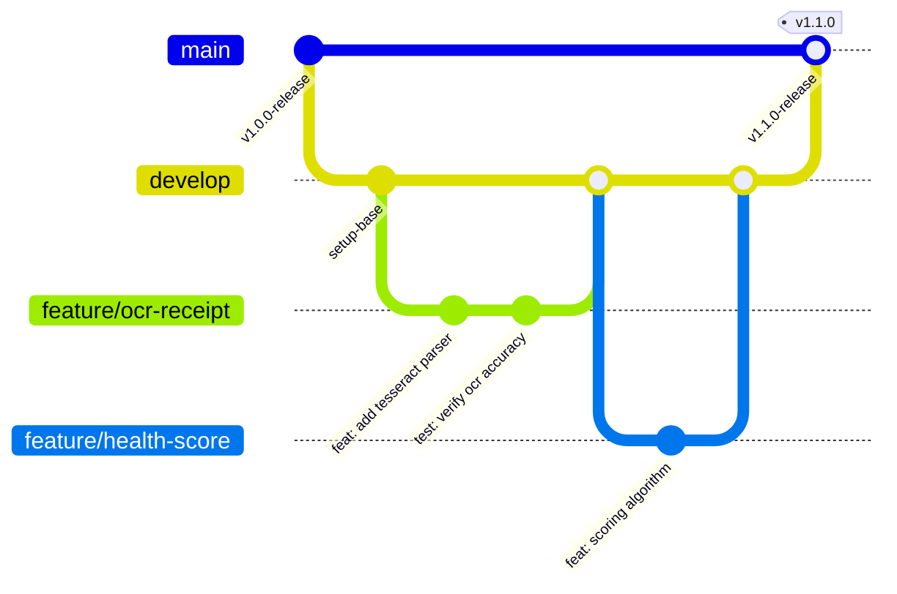

# Panduan Workflow, DevOps & Kontribusi
# SADAR Finance — Engineering & Development Workflow Guide

| Versi Dokumen | Target Tim | Terakhir Diperbarui | Status |
|---|---|---|---|
| **v1.0.0** | **Seluruh Software Engineer & DevOps** | **Agustus 2026** | **Active Guideline** |

---

## 1. Strategi Git & Standar Percabangan (*Branching Strategy*)

Untuk memastikan alur pengembangan teratur, terhindar dari *merge conflict*, dan siap rilis setiap saat, tim menerapkan standar **Git Flow**:



### 1.1 Penamaan Branch
- **`main`**: Kode sumber stabil yang siap digunakan di *production*. Hanya menerima *merge* dari `develop` atau `hotfix/*`.
- **`develop`**: Pusat integrasi seluruh fitur yang sedang dikembangkan.
- **`feature/<nama-fitur>`**: Pengembangan fitur baru (contoh: `feature/ocr-receipt-scan`, `feature/health-score-gauge`).
- **`bugfix/<deskripsi-bug>`**: Perbaikan bug non-kritis (contoh: `bugfix/fix-date-picker-timezone`).
- **`hotfix/<deskripsi-kritis>`**: Perbaikan darurat langsung dari branch `main` (contoh: `hotfix/cors-origin-patch`).

### 1.2 Format Pesan Commit (*Conventional Commits*)
```
<tipe>(<cakupan opsional>): <deskripsi singkat dalam bahasa indonesia / inggris>

[Contoh]
feat(ocr): tambahkan ekstraksi tanggal dan merchant otomatis
fix(auth): perbaiki token expiry handling pada refresh request
docs(api): perbarui spesifikasi payload endpoint health score
refactor(analytics): optimalkan kueri agregasi kategori pengeluaran
test(backend): tambahkan unit test untuk kalkulasi financial score
```

---

## 2. Panduan Setup Lingkungan Lokal (*Step-by-Step Local Setup*)

### 2.1 Prasyarat Perangkat Lunak (*Prerequisites*)
- **Node.js**: Versi 18 LTS atau 20 LTS (`node -v`).
- **Python**: Versi 3.10 atau 3.11 (`python --version`).
- **PostgreSQL**: Versi 15+ (Bisa dijalankan via Laragon / PostgreSQL Service / Docker).
- **Git**: Versi 2.x+.

---

### 2.2 Langkah 1: Setup Backend API (Node.js & Express)

```bash
# Masuk ke direktori backend
cd backend

# Install seluruh dependensi
npm install

# Buat file konfigurasi lingkungan (.env)
cp .env.example .env
```

Sesuaikan nilai variabel pada file `backend/.env`:
```env
PORT=5000
NODE_ENV=development

# Konfigurasi Database PostgreSQL (Contoh Laragon / Default Postgres)
DB_HOST=127.0.0.1
DB_PORT=5432
DB_NAME=sadar_finance
DB_USER=postgres
DB_PASSWORD=root

# Keamanan & JWT
JWT_SECRET=super_secret_sadar_jwt_key_2026_production_ready
JWT_EXPIRES_IN=24h

# URL Layanan AI Python
AI_SERVICE_URL=http://127.0.0.1:8000

# CORS Whitelist
ALLOWED_ORIGINS=http://localhost:5173,http://localhost:3000
```

```bash
# Jalankan migrasi tabel database
npm run db:migrate

# Isi data awal dummy untuk pengujian
npm run db:seed

# Jalankan server backend dalam mode pengembangan (auto-reload)
npm run dev
```
> Server backend berjalan di: `http://localhost:5000` (Dokumentasi Swagger di `http://localhost:5000/api/docs`).

---

### 2.3 Langkah 2: Setup Frontend Web Client (React + Vite)

Buka terminal baru:
```bash
# Masuk ke direktori frontend
cd frontend

# Install dependensi UI & library
npm install

# Buat file konfigurasi lingkungan (.env)
cp .env.example .env
```

Isi file `frontend/.env`:
```env
VITE_API_URL=http://localhost:5000/api/v1
```

```bash
# Jalankan server pengembangan Vite
npm run dev
```
> Aplikasi web dapat diakses di browser: `http://localhost:5173`.
> **Akun Default Demo**: `aqyla@example.com` / `password123`.

---

### 2.4 Langkah 3: Setup Microservice AI & OCR (Python)

Buka terminal baru:
```bash
# Masuk ke direktori ai
cd ai

# Buat virtual environment python
python -m venv venv

# Aktifkan virtual environment
# Windows (PowerShell/CMD):
venv\Scripts\activate
# Linux/macOS:
source venv/bin/activate

# Install dependensi machine learning & web server
pip install -r requirements.txt

# Jalankan microservice AI
python app.py
```
> AI Microservice berjalan di: `http://localhost:8000`.

---

## 3. Standar & Konvensi Penulisan Kode (*Coding Standards*)

### 3.1 Frontend (React 18 + Vite)
- **Komponen Fungsional & Hooks**: Gunakan fungsional komponen murni dengan hooks (`useState`, `useEffect`, `useCallback`, `useMemo`).
- **Struktur Folder**:
  - `src/pages/`: Halaman-halaman rute utama (`SadarDashboard`, `SadarBehaviorInsight`, dll.).
  - `src/Components/`: Komponen UI yang dapat digunakan kembali (*reusable*).
  - `src/helpers/`: Fungsi utilitas pemformatan mata uang, tanggal, dan API client.
- **Hindari Inline Styles**: Gunakan kelas Tailwind CSS atau file modul CSS terstruktur.
- **Pembersihan State**: Selalu lakukan *cleanup* pada `useEffect` yang memiliki interval atau subscription.

### 3.2 Backend (Node.js / Express)
- **Pola Arsitektur Layered (Controller - Service - Repository)**:
  - `routes/`: Hanya mendefinisikan URL endpoint dan middleware autentikasi/validasi.
  - `controllers/`: Menerima `req`, memanggil service, dan mengembalikan `res` standar.
  - `services/`: Memuat seluruh aturan bisnis, perhitungan matematis, dan integrasi AI.
  - `repositories/`: Berinteraksi langsung dengan database PostgreSQL melalui parameterized SQL query.
- **Penanganan Error Terpusat**: Selalu gunakan custom error class (`BadRequestError`, `UnauthorizedError`, `NotFoundError`) dan teruskan ke `next(err)`.

### 3.3 Database PostgreSQL
- Selalu gunakan huruf kecil (*snake_case*) untuk penamaan tabel dan kolom.
- Kunci primer selalu bertipe `UUID` untuk mencegah *ID enumeration attacks*.
- Seluruh kolom yang sering difilter (`user_id`, tanggal, status) wajib memiliki indeks.

---

## 4. Prosedur Pengujian & QA Checklist (*Quality Assurance*)

Sebelum mengajukan *Pull Request* (*PR*), pastikan daftar periksa berikut telah terpenuhi:

- [ ] **Linter & Syntax**: `npm run lint` berjalan tanpa error fatal.
- [ ] **Database Integrity**: Skrip migrasi `npm run db:migrate` dan seed `npm run db:seed` berhasil dieksekusi tanpa galat.
- [ ] **Auth Flow**: Register pengguna baru, Login, Akses Dashboard, Update Profil, dan Logout berjalan mulus.
- [ ] **Transaksi & Saldo**: Menambah pengeluaran mengurangi saldo akun terkait, menambah income menambah saldo.
- [ ] **Scan Struk OCR**: Unggah struk menghasilkan parsing nominal, merchant, dan kategori secara tepat.
- [ ] **Resiliensi AI**: Ketika AI Service dimatikan, halaman Dashboard dan Behavior Insight tetap menampilkan data via rule-based fallback tanpa error 500.
- [ ] **Responsivitas Layar**: Layout tetap rapi pada resolusi Desktop (1920x1080), Tablet (768px), dan Layar Ponsel (375px).

---

## 5. Panduan Deployment Production

### 5.1 Deployment Frontend (Vercel)
1. Hubungkan repositori GitHub ke dashboard Vercel.
2. Atur **Root Directory** ke `frontend`.
3. Build Command: `npm run build`, Output Directory: `dist`.
4. Masukkan Environment Variable:
   - `VITE_API_URL`: `https://backend-production-url.railway.app/api/v1`
5. Pastikan file `vercel.json` ada di root frontend untuk menangani client-side routing SPA.

### 5.2 Deployment Backend & AI (Railway)
1. Buat project baru di Railway dan tambahkan PostgreSQL Database plugin.
2. Tambahkan Web Service untuk `backend` dengan Root Directory `backend`.
3. Masukkan Environment Variable Database URL dan Secret Key.
4. Tambahkan Docker Service untuk `ai` dengan Root Directory `ai`.
5. Hubungkan URL internal service AI ke variabel `AI_SERVICE_URL` pada backend.

---

## 6. Panduan Pemecahan Masalah Umum (*Troubleshooting*)

| Masalah / Error | Kemungkinan Penyebab | Solusi Tindakan |
|---|---|---|
| `CORS error: Not allowed by CORS` | Domain frontend belum terdaftar di backend `ALLOWED_ORIGINS` | Tambahkan URL frontend (termasuk port) ke variabel `ALLOWED_ORIGINS` di file `.env` backend. |
| `Postgres Connection Refused (ECONNREFUSED)` | PostgreSQL service belum menyala atau port 5432 tertutup | Pastikan Laragon/PostgreSQL berjalan, cek username dan password pada file `.env`. |
| `OCR Scan Error / Timeout` | Microservice Python belum dijalankan | Jalankan microservice AI (`python app.py` di direktori `ai`) atau biarkan sistem fallback otomatis bekerja. |
| `Vite page refresh 404 pada sub-route` | Web server tidak me-rewrite rute SPA ke `index.html` | Pastikan konfigurasi `vercel.json` rewrite terpasang dengan benar pada production. |
